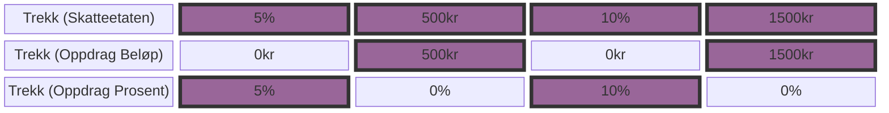

# sokos-utleggstrekk

## Applikasjon for å få inn  utleggstrekk fra skatteetaten

I Skatteetaten består et trekk av perioder. En periode kan ha en prosentsats eller en beløpssats.
I Oppdrag Z (Stormaskin) består også trekk av perioder, men her er det trekket som er av typen prosent eller beløpstrekk.

For å håndtere denne forskjellen vil trekk som har perioder med forskjellig type sats bli modellert i Oppdrag som to
forskjellige trekk, ett for perioder med prosentsats og ett for perioder med beløp.
Disse to trekkene vil ha de samme periodene, men dersom en periode har prosent-trekk, vil trekket med beløp være satt til 0 for denne perioden.
Dersom en periode har beløpstrekk vil trekket med prosent være satt til null. 

Dersom alle periodene til et trekk er av samme type vil det også bare være ett trekk i Oppdrag.

En annen forskjell er at Skatteetaten leverer trekk som selvsendige øyeblikksbilder av gjeldende perioder, mens Oppdragsystemet
mottar en forskjell eller endring på gjeldende trekk. Oppdrag krever også at perioder for månedstrekk starter på den 1. i måneden og avsluttes på den siste dagen i måneden.
Dette gjør at skatteetaten vil sende trekkversjoner hvor en tidligere åpen periode (uten sluttdato) blir erstattet av en periode med sluttdato satt. Dette betyr at
den tidligere åpne perioden må slettes i Oppdrag Z.



### Lokal kjøring (krever naisdevice)

- Kjør scriptet [setupLocalEnvironment.sh](setupLocalEnvironment.sh)
     ```
     chmod 755 setupLocalEnvironment.sh && ./setupLocalEnvironment.sh
     ```                                
  Denne vil opprette [default.properties](defaults.properties) med alle environment variabler (bortsett fra
  POSTGRES_USERNAME og POSTGRES_PASSWORD, som må hentes manuelt fra vault) du trenger for å kjøre
  applikasjonen som er definert i [PropertiesConfig](src/main/kotlin/no/nav/sokos/utleggstrekk/config/PropertiesConfig.kt).


- Lag proxy mot DB ved [ kjøre ] [startProxy.sh](startProxy.sh)
     ```
     chmod 755 startProxy.sh && ./startProxy.sh
     ```                                
- Kjør applikasjonen
     ```
    ./gradlew run
     ```                                

### [Dokumentasjon](dokumentasjon/README.md)

