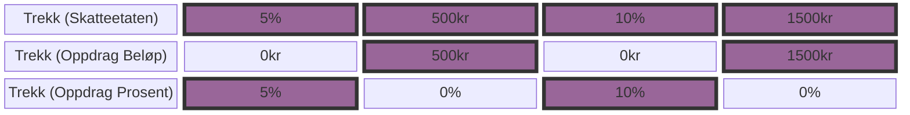
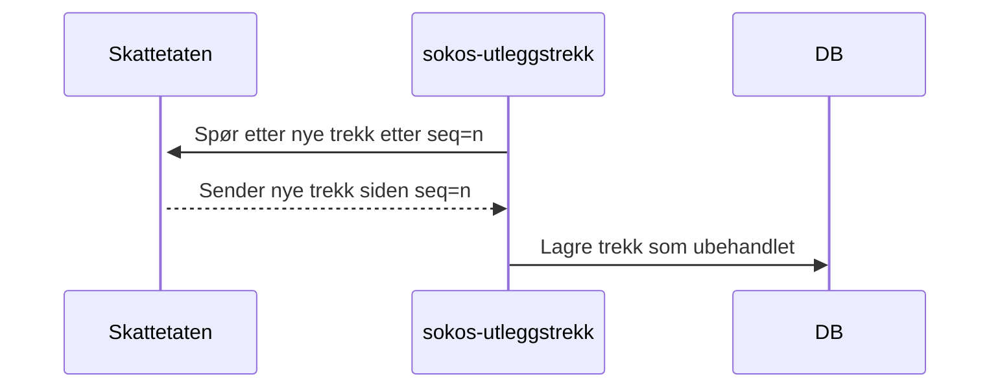
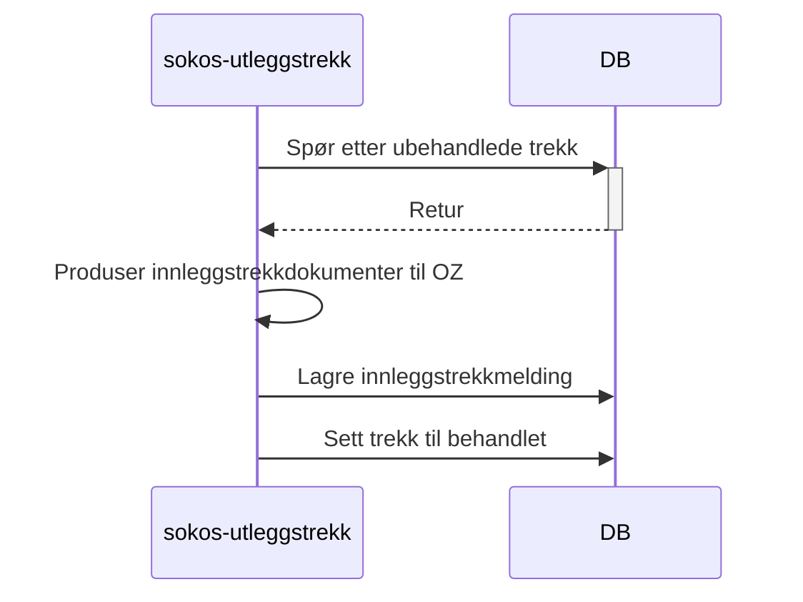
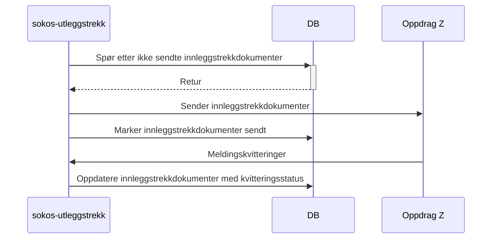

# sokos-utleggstrekk

## Applikasjon for å få inn  utleggstrekk fra skatteetaten

I Skatteetaten består et trekk av perioder. En periode kan ha en prosentsats eller en beløpssats.
I Oppdrag (Stormaskin) består også trekk av perioder, men her er det trekket som er av typen prosent eller beløpstrekk.

For å håndtere denne forskjellen vil trekk som har perioder med forskjellig type sats bli modellert i Oppdrag som to
forskjellige trekk, ett for perioder med prosentsats og ett for perioder med beløp.
Disse to trekkene vil ha de samme periodene, men dersom en periode har prosent-trekk, vil trekket med beløp være satt til 0 for denne perioden.
Dersom en periode har beløpstrekk vil trekket med prosent være satt til null.

Dersom alle periodene til et trekk er av samme type vil det også bare være ett trekk i Oppdrag.



### Input for lokal kjøring

- Kjør scriptet [setupLocalEnvironment.sh](setupLocalEnvironment.sh)
     ```
     chmod 755 setupLocalEnvironment.sh && ./setupLocalEnvironment.sh
     ```                                
  Denne vil opprette [default.properties](defaults.properties) med alle environment variabler (bortsett fra
  POSTGRES_USERNAME og POSTGRES_PASSWORD, som må hentes manuelt fra vault) du trenger for å kjøre
  applikasjonen som er definert i [PropertiesConfig](src/main/kotlin/sokos/ske/krav/config/PropertiesConfig.kt).

## Hva gjør sokos-utløeggstrekk








### Den gjør i hovesak 2 ting (to løyper om du vil)
1. henter nye eller endringer til tidligere utleggstrekk fra skatteetaten ved "et-trekk" og sender alle  mottate trekk videre til trekk komponenten i OS
2. henter kvitteringer fra OS og oppdaterer database

### Løype 1: 
Henter trekk fra Skatt og sender til OS
   1. Henter via rest, bruker maskinporten.
   2. Lagrer alle trekk i UtleggstrekkTable og alle perioder i PeriodeTable
   3. Bearbeider trekk slik at det kun er et trekkAlternativ per trekk
      - Setter sammen alle perioder av et trekkAlternativ for hvert trekk.  Derom et trekk har to trekkAlternativ blir det sendt to trekk til OS for hver versjon av trekket vi mottar fra SKATT
   4. Oppretter dokumentet som skal sendes til OS og sender på MQ
   
### Løype 2
Henter og lagrer kvitteringer fra OS
  1. Henter kvitteringer fra MQ kø
  2. Lagrer alle kvitteringer for de trekk de gjelder
  3. Lagrer alle feilmeldinger i feilmeldingsTabell
  4. IKKE IMPLEMENTERT: Bør varsle dersom det er feil. Har lagt til iler for å bruke Slack