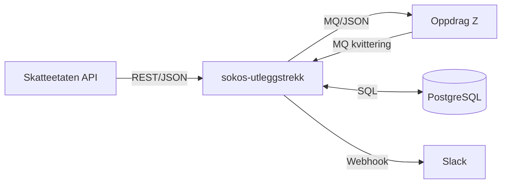

# sokos-utleggstrekk

Deployes i GCP (Google Cloud Platform) via NAIS.

## Innholdsfortegnelse

| Dokument | Beskrivelse |
|----------|-------------|
| [Arkitektur](arkitektur/README.md) | Systemarkitektur, integrasjoner og deploy-modell |
| [Kom i gang](kom-i-gang/README.md) | Oppsett av utviklingsmiljø og lokal kjøring |
| [Kodestruktur](kodestruktur/README.md) | Pakkestruktur, viktige klasser og ansvar |
| [Trekksplitting](trekksplitting/README.md) | Hvordan ett trekkpålegg kan bli to trekk i Oppdrag Z |
| [Periodeberegning](periodeberegning/README.md) | Diff-algoritmen: hvordan vi beregner hvilke perioder som sendes til OS |
| [Flytdiagram og forretningslogikk](flytdiagram/README.md) | Tilstandsflyt, periodebehandling og forretningsregler |
| [Sekvensdiagrammer](sekvensdiagrammer.md) | Kommunikasjonsflyt mellom systemer |
| [Datamodell](datamodell/README.md) | Databasetabeller og relasjoner |
| [Driftshåndbok](drift/README.md) | Feilsituasjoner, korrigering og gjenoppbygging |

### Detaljerte flytdiagrammer

- [Oversikt](flytdiagram/00_oversikt.md)
- [Henting fra Skatteetaten](flytdiagram/01_henting_fra_ske.md)
- [Validering og lagring](flytdiagram/02_validering_og_lagring.md)
- [Behandling](flytdiagram/03_behandling.md)
- [Sending til Oppdrag Z](flytdiagram/04_sending_til_os.md)
- [Kvittering](flytdiagram/05_kvittering.md)
- [Opprydding](flytdiagram/06_opprydding.md)

---

## Hva gjør sokos-utleggstrekk?

Applikasjonen henter utleggstrekk (trekkpålegg) fra Skatteetaten og videresender dem til Oppdrag Z (NAVs stormaskin for utbetalinger). Den kjører som en schedulert jobb hver time.

### Hovedflyten

### Schedulert jobb (hver time)

Hver time trigges `UtleggsTrekkService.schedule()` på minuttet konfigurert i `SCHEDULER_MINUTES` og utfører følgende:

1. **Henter nye trekkpålegg** fra Skatteetaten fra siste kjente sekvensnummer og lagrer disse i databasen
2. **Behandler trekk** – sammenlikner med tidligere innrapporteringstrekk og genererer NY eller ENDR-dokumenter
3. **Sender til Oppdrag Z** over IBM MQ

4. **Sletter gamle data** – data som tilhører trekk avsluttet for mer enn 6 måneder siden

### Daglig jobb (kl 08:00)

Rapporterer manglende kvitteringer til Slack for transaksjoner sendt mer enn 24 timer tidligere.

---

## Kjernekonsept: Trekksplitting

I Skatteetaten består et trekk av perioder som kan ha enten prosentsats ELLER beløpssats.
I Oppdrag Z er det selve **trekket** som er av typen prosent eller beløp – alle perioder i et trekk må være av samme type.

Når et trekkpålegg fra Skatteetaten har perioder med **både** prosent og beløp, kan det ikke sendes som ett trekk til Oppdrag Z. Derfor splitter sokos-utleggstrekk det til **to trekk som begge representerer det samme underliggende trekkpålegget** – ett prosenttrekk (LOPP) og ett beløpstrekk (LOPM).

➡️ **[Les fullstendig forklaring med eksempler](trekksplitting/README.md)**

---

## Konfigurasjon

### Applikasjon

| Property | Default | Forklaring | Kilde |
|----------|---------|------------|-------|
| NAIS_APP_NAME | sokos-utleggstrekk | Navnet på applikasjonen | NAIS |
| NAIS_NAMESPACE | okonomi | Navnet på namespace | NAIS |
| SOKOS_UTLEGGSTREKK_SLACK_WEBHOOK_URL | | Webhook for Slack-alarmer | NAIS secret |
| MASKINPORTEN_SYSTEMBRUKER_CLAIM | | Organisasjonsnummer for systembruker-claim | application.conf |

### Database

| Property | Default | Forklaring |
|----------|---------|------------|
| POSTGRES_HOST | dev-pg.intern.nav.no | DB Hostname |
| POSTGRES_PORT | 5432 | DB Port |
| POSTGRES_NAME | sokos-utleggstrekk | Databasenavn |
| POSTGRES_USERNAME | sokos-utleggstrekk | Databasebruker (kun utvikling) |
| POSTGRES_PASSWORD | | Passord (kun utvikling) |
| POSTGRES_JDBC_URL | | JDBC URL (NAIS) |

### MQ (IBM MQ)

| Property | Default | Forklaring | Kilde |
|----------|---------|------------|-------|
| MQ_HOSTNAME | mqls02.preprod.local | MQ hostname | application-{env}.conf |
| MQ_PORT | | MQ port | application-{env}.conf |
| MQ_CHANNEL | Q1_UTLEGGSTREKK | MQ channel | application-{env}.conf |
| MQ_QUEUE_NAME | QA.Q1_231.OB04_TREKK_FRASKATT_JSON | Sendekø til OS | application-{env}.conf |
| MQ_REPLYQUEUE_NAME | QA.Q1_SOKOS_UTLEGGSTREKK.KVITTERING | Kvitteringskø fra OS | application-{env}.conf |
| MQ_USERNAME | | MQ brukernavn | NAIS Secret |
| MQ_PASSWORD | | MQ passord | NAIS Secret |

### Skatteetaten

| Property | Default | Forklaring | Kilde |
|----------|---------|------------|-------|
| `skeConfig.skeRestUrl` | https://api-test.sits.no/api/trekkpaalegg/v1 | REST-endepunkt | application-{env}.conf |
| `skeConfig.skeOrgNr` | 971648199 | Skatteetatens orgnummer → TSS ID | application-{env}.conf |
| `skeConfig.skeTSSId` | | TSS ID for Skatteetaten | application-{env}.conf |
| `skeConfig.skeKontoNr` | | Skatteetatens kontonummer | application-{env}.conf |

---

## Feature Toggles (Unleash)

Tre kill-switcher i [Unleash](https://okonomi-unleash-web.iap.nav.cloud.nais.io/):

| Toggle | Styrer |
|--------|--------|
| `sokos-utleggstrekk.hent-fra-ske.enabled` | Henting av trekk fra Skatteetaten |
| `sokos-utleggstrekk.prosesser-utleggstrekk.enabled` | Behandling/prosessering av trekk |
| `sokos-utleggstrekk.send-til-os.enabled` | Sending til Oppdrag Z |

---

## Bruk av Skatteetatens APIer

NAVs NAIS-plattform tildeler en Maskinporten-bruker knyttet til NAVs hovedorganisasjonsnummer (889640782).
For å hente trekkpålegg for NAVs brukere brukes en **systembruker** knyttet til NAV Økonomilinjen (995277670).

Systemet vedlikeholdes av NAIS-jobben [sokos-systembruker-vedlikehold](https://github.com/navikt/sokos-systembruker-vedlikehold/tree/main).

Se også:
- [Skatteetatens dokumentasjon](https://skatteetaten.github.io/api-dokumentasjon/om/systembruker)
- [Utbetalingsseksjonens Confluence](https://confluence.adeo.no/spaces/TOB/pages/739049218/Maskinporten+og+system+users)
