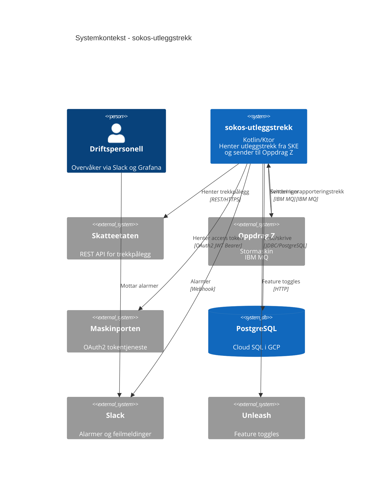
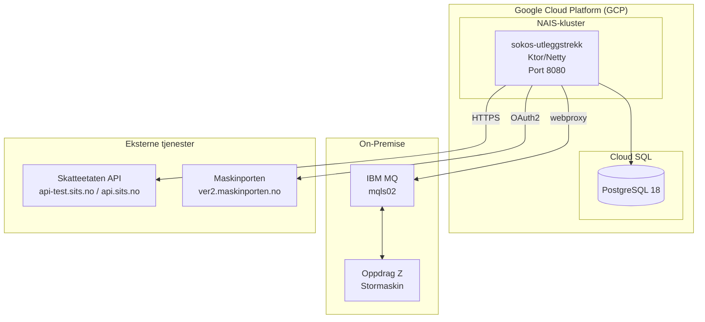
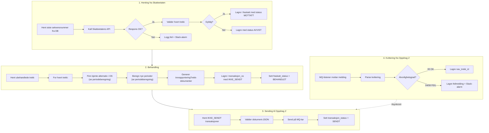
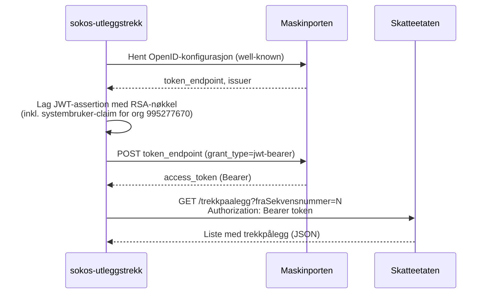

# Arkitektur

## Systemkontekst

sokos-utleggstrekk er en backend-tjeneste uten brukergrensesnitt som fungerer som en bro mellom Skatteetatens trekkpålegg-API og NAVs Oppdragssystem (Oppdrag Z).

## Deployment-modell

### Miljøer

| Miljø | Kluster | Ingress | MQ Host |
|-------|---------|---------|---------|
| Dev | dev-gcp | sokos-utleggstrekk.intern.dev.nav.no | mqls02.preprod.local:1413 |
| Prod | prod-gcp | sokos-utleggstrekk.intern.nav.no | mqls02.prod.local:1413 |

### Infrastrukturkomponenter

| Komponent | Teknologi | Formål |
|-----------|-----------|--------|
| Runtime | JVM 25 / Kotlin 2.4 | Applikasjonskode |
| Web-server | Ktor 3.5 / Netty | HTTP-endepunkter |
| Database | PostgreSQL 18 (Cloud SQL) | Persistering av trekk |
| Meldingskø | IBM MQ | Kommunikasjon med Oppdrag Z |
| Autentisering | Maskinporten + Systembruker | Tilgang til Skatteetatens API |
| Feature toggles | Unleash | Kill-switcher for hvert steg |
| Observability | Prometheus + Micrometer | Metrikker |
| Logging | Logback + Logstash | Strukturert logging |
| Alarmer | Slack Webhook | Feilvarsling |
| CI/CD | GitHub Actions | Bygg og deploy |

---

## Dataflyt (detaljert)

---

## Sikkerhet

### Autentiseringsflyt mot Skatteetaten

### Sikkerhetsprinsipper

- **Maskinporten med systembruker**: Applikasjonen autentiserer seg med NAV Økonomilinjas organisasjonsnummer
- **RSA-signert JWT**: Private key fra NAIS-secret brukes til å signere JWT-forespørsler
- **Token-caching**: Access tokens caches og fornyes 1 minutt før utløp
- **Input-validering**: All data fra Skatteetaten valideres mot strenge regler (gyldige tegn, datoformat, lengder)
- **Output-validering**: Dokumenter valideres før de sendes til Oppdrag Z

---

## Skaleringsmodell

- **Replicas**: Alltid 1 instans (max=1, min=1) – jobben er ikke designet for parallellkjøring
- **Ressurser**: 100m CPU request, 512Mi–4096Mi minne
- **Database**: Cloud SQL med Point-in-Time Recovery og SSD
- **Auto-reconnect**: MQ-klienten har auto-reconnect til queue manager
