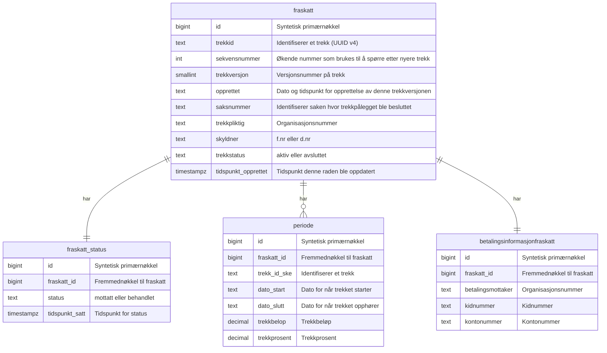

# Trekkpålegg
Dette er datamodellen for Trekkpålegg fra Skatteetaten.
Hver rad i fraskatt-tabellen er en trekk*versjon*. Kun den siste trekkversjonen er den gyldige. Skatteetatens APIer returnerer kun siste versjonen
av et trekk. Fordi Oppdrag Zs API opererer med endringer på trekk tar vi vare på tidligere versjoner for å kunne beregne differansen.

