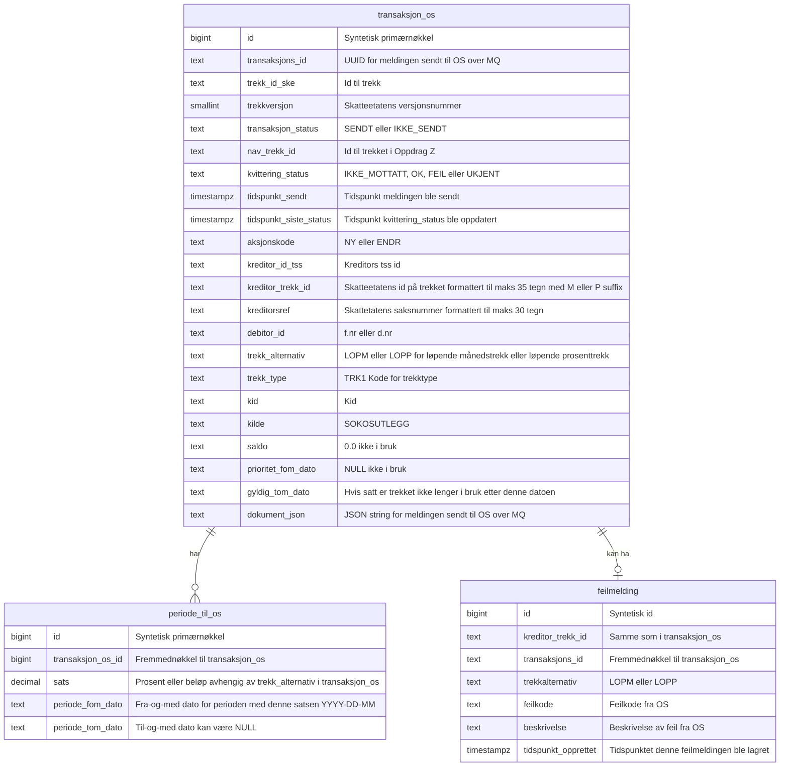

Dette er datamodellen for InnrapporteringTrekk som sendes til Oppdrag Z

```mermaid
---
transaksjon_os
---
erDiagram
    transaksjon_os ||--o{ periode_til_os: har
    transaksjon_os ||--o| feilmelding: "kan ha"
    transaksjon_os {
        bigint id "Syntetisk primærnøkkel"
        text transaksjons_id "UUID for meldingen sendt til OS over MQ"
        text trekk_id_ske "Id til trekk"
        smallint trekkversjon "Skatteetatens versjonsnummer"
        text transaksjon_status "SENDT eller IKKE_SENDT"
        text nav_trekk_id "Id til trekket i Oppdrag Z"
        text kvittering_status "IKKE_MOTTATT, OK, FEIL eller UKJENT"
        timestampz tidspunkt_sendt "Tidspunkt meldingen ble sendt"
        timestampz tidspunkt_siste_status "Tidspunkt kvittering_status ble oppdatert"
        text aksjonskode "NY eller ENDR"
        text kreditor_id_tss "Kreditors tss id"
        text kreditor_trekk_id "Skatteetatens id på trekket formattert til maks 35 tegn med M eller P suffix"
        text kreditorsref "Skattetatens saksnummer formattert til maks 30 tegn"
        text debitor_id "f.nr eller d.nr"
        text trekk_alternativ "LOPM eller LOPP for løpende månedstrekk eller løpende prosenttrekk"
        text trekk_type "TRK1 Kode for trekktype"
        text kid "Kid"
        text kilde "SOKOSUTLEGG"
        text saldo "0.0 ikke i bruk"
        text prioritet_fom_dato "NULL ikke i bruk"
        text gyldig_tom_dato "Hvis satt er trekket ikke lenger i bruk etter denne datoen"
        text dokument_json "JSON string for meldingen sendt til OS over MQ" 
    }
    periode_til_os {
        bigint id "Syntetisk primærnøkkel"
        bigint transaksjon_os_id "Fremmednøkkel til transaksjon_os"
        decimal sats "Prosent eller beløp avhengig av trekk_alternativ i transaksjon_os"
        text periode_fom_dato "Fra-og-med dato for perioden med denne satsen YYYY-DD-MM"
        text periode_tom_dato "Til-og-med dato kan være NULL "
    }
    feilmelding {
        bigint id "Syntetisk id"
        text kreditor_trekk_id "Samme som i transaksjon_os"
        text transaksjons_id "Fremmednøkkel til transaksjon_os"
        text trekkalternativ "LOPM eller LOPP"
        text feilkode "Feilkode fra OS"
        text beskrivelse "Beskrivelse av feil fra OS"
        timestampz tidspunkt_opprettet "Tidspunktet denne feilmeldingen ble lagret"
    }
```