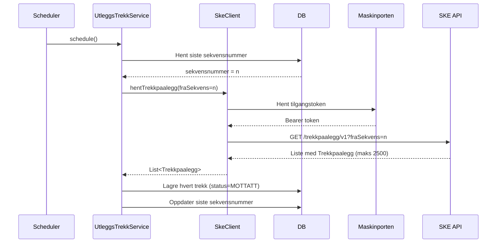
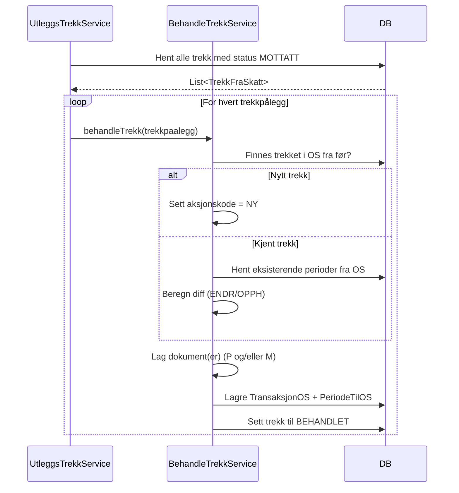
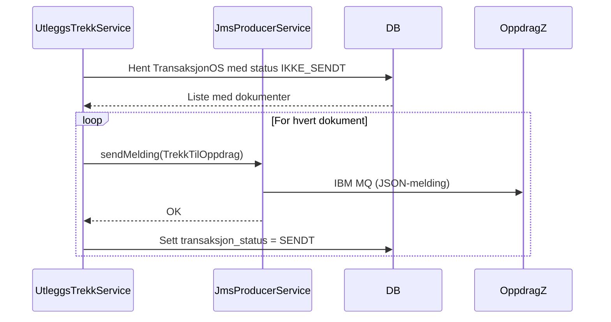
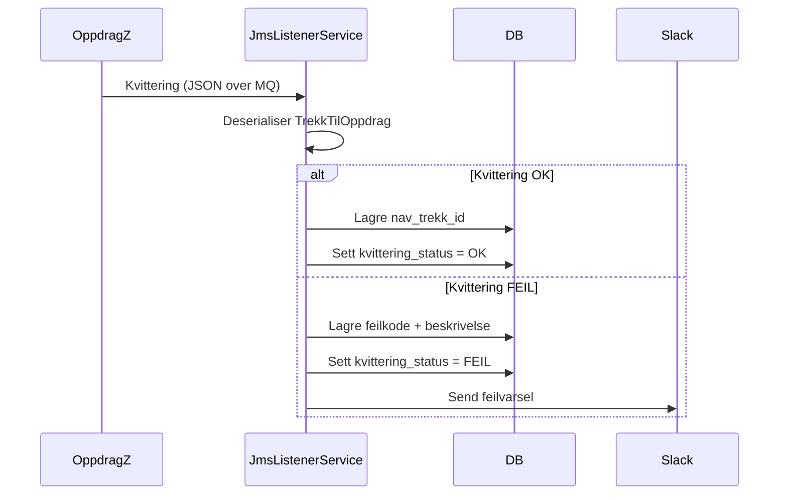

# Detaljert flyt – sokos-utleggstrekk

## Innganspunkt: Scheduler

`UtleggsTrekkScheduler` trigges én gang per time (på minuttet satt i `SCEDULER_MINUTES`) og kaller `UtleggsTrekkService.schedule()`.

```kotlin
// UtleggsTrekkScheduler – forenklet
fun startScheduler() {
    coroutineScope.launch {
        while (true) {
            val now = LocalDateTime.now()
            if (now.minute == schedulerMinutes) {
                utleggsTrekkService.schedule()
            }
            delay(60_000)
        }
    }
}
```

Feature toggle `sokos-utleggstrekk.hent-fra-ske.enabled` / `prosesser-utleggstrekk.enabled` / `send-til-os.enabled` styrer hva som faktisk kjøres.

---

## Steg 1: Hent trekkpålegg fra Skatteetaten



**Detaljer:**
- `SkeClient` håndterer paginering automatisk (henter inntil 2 500 per kall)
- Token caches i Maskinporten-klienten mellom kall
- Hvert mottatt `Trekkpaalegg` lagres som `TrekkFraSkatt` i `fraskatt`-tabellen
- `fraskatt_status` settes til `MOTTATT`

---

## Steg 2: Behandle trekkpålegg (BehandleTrekkService)



**Tilstandsmaskin for behandling:**

| Situasjon | Aksjonskode | Forklaring |
|-----------|-------------|------------|
| Trekket finnes ikke i OS | `NY` | Første gang dette trekket sendes |
| Trekket finnes i OS, perioder er endret | `ENDR` | Oppdaterer eksisterende trekk |
| Trekket er avsluttet i SKE | `OPPH` | Ingen nye periodeoppdateringer sendes |

---

## Steg 3: Send til Oppdrag Z via MQ



---

## Steg 4: Motta kvitteringer (asynkront)

`JmsListenerService` lytter kontinuerlig på kvitteringskøen og prosesserer meldinger uavhengig av scheduler-syklusen.



---

## Steg 5: Rapportering og metrics

Etter prosesseringssyklusen:

1. **Manglende kvitteringer:** Transaksjoner sendt for mer enn X timer siden uten kvittering rapporteres til Slack
2. **Prometheus-metrics:** Antall trekk per status oppdateres og eksponeres på `/internal/metrics`
3. **Datavask:** Trekk tilknyttet avsluttede saker eldre enn 6 måneder slettes

---

## Feilhåndtering

| Feilscenario | Håndtering |
|-------------|------------|
| SKE API utilgjengelig | Logger feil, stopper henting for denne syklusen |
| Valideringsfeil i trekk | Status settes til `AVVIST`, meldes til Slack |
| MQ-sending feiler | Transaksjonen forblir `IKKE_SENDT`, prøves på nytt neste syklus |
| Kvittering med feil | Status `FEIL`, feilkode lagres, Slack-varsel sendes |
| Manglende kvittering | Rapporteres til Slack etter timeout |
