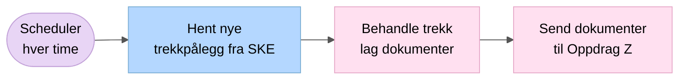
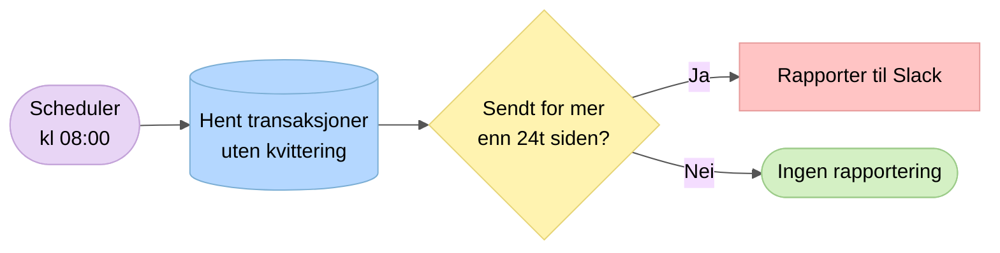

# 0. Oversikt – Schedulert jobb

Hver time trigges `UtleggsTrekkService.schedule()`. Flyten styres av tre uavhengige feature toggles i Unleash.

## Daglig jobb (kl 08:00)

I tillegg kjøres `reportMissingKvittering()` daglig. Denne rapporterer transaksjoner sendt til OS for mer enn 24 timer siden som fortsatt mangler kvittering.

## Feature toggles (Unleash)

| Toggle | Styrer |
|--------|--------|
| `sokos-utleggstrekk.hent-fra-ske.enabled` | Henting av trekk fra Skatteetaten |
| `sokos-utleggstrekk.prosesser-utleggstrekk.enabled` | Behandling/prosessering av trekk |
| `sokos-utleggstrekk.send-til-os.enabled` | Sending til Oppdrag Z |
