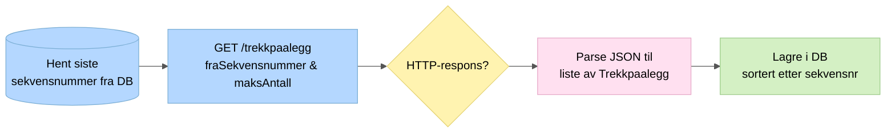

# 1. Henting fra Skatteetaten

Henter nye trekkpålegg fra Skatteetatens REST API paginert fra siste kjente sekvensnummer. Autentiseres med Maskinporten-token via systembruker.

## Paginering

Henting skjer i en `do-while`-loop. Hver side henter opptil 2500 trekkpålegg (`MAX_ANTALL`). Dersom svaret inneholder nøyaktig 2500, finnes det sannsynligvis flere og neste side hentes med oppdatert sekvensnummer.

## Nøkkelpunkter

- Trekkpålegg lagres sortert etter sekvensnummer for å unngå hull ved feil
- Maskinporten-token hentes via systembruker (NAV Økonomilinjen, org.nr 995277670)
- Ved parse- eller lagringsfeil avbrytes videre henting
