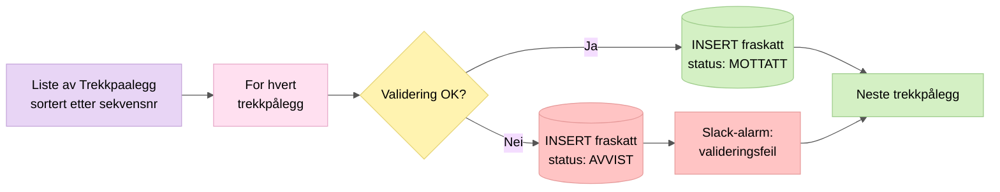

# 2. Validering og lagring

Hvert trekkpålegg valideres og lagres i databasen. Ugyldige trekk markeres som AVVIST men lagres likevel for sporbarhet.

## Nøkkelpunkter

- Trekkpålegg sorteres etter sekvensnummer slik at vi aldri lagrer et nyere trekk uten å ha lagret alle eldre
- Valideringsfeil gir status `AVVIST` men stopper ikke prosessering av neste trekk
- Databasefeil derimot kaster exception og stopper all videre henting (for å unngå hull i sekvensen)
- Hvert trekkpålegg lagres med sine perioder, betalingsinformasjon og status i egne tabeller

## Datamodell

| Tabell | Innhold |
|--------|---------|
| `fraskatt` | Hoveddata: trekkid, trekkversjon, skyldner, saksnummer, trekkstatus |
| `periode` | Perioder med start/slutt-dato og sats (prosent eller beløp) |
| `betalingsinformasjon` | Kreditors kontonr, orgnr, KID |
| `fraskatt_status` | Nåværende behandlingsstatus (MOTTATT, BEHANDLET, AVVIST, ...) |
