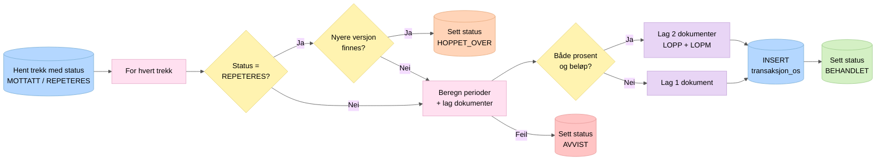
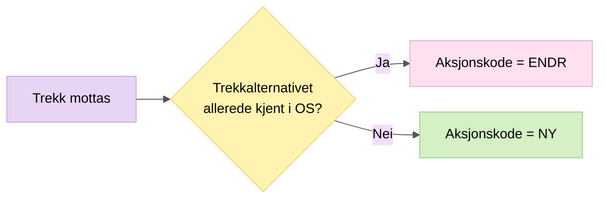

# 3. Behandling av trekk

`BehandleTrekkService.behandleTrekk()` henter alle ubehandlede trekk og lager dokumenter (JSON) som skal sendes til Oppdrag Z.

## Aksjonskode

Aksjonskoden bestemmes per trekkalternativ:

## Avsluttede trekk

Når et trekk har `trekkstatus = AVSLUTTET` sendes et dokument **uten perioder** der kun `gyldigTomDato` settes til dagens dato.

## Nøkkelpunkter

- Hele behandlingen skjer i en databasetransaksjon per trekk
- Ved feil rulles transaksjonen tilbake og trekket settes til AVVIST
- REPETERES-trekk sjekkes mot nyere versjoner for å unngå å overskrive nyere data
- Dokumentet som lages er en `TrekkTilOppdrag` JSON som serialiseres og lagres i `transaksjon_os`
