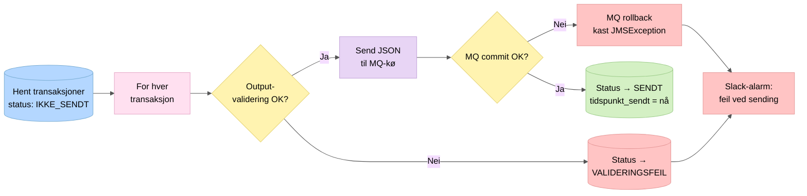

# 4. Sending til Oppdrag Z

Dokumenter med status `IKKE_SENDT` hentes fra `transaksjon_os` og sendes til Oppdrag Z over IBM MQ.

## MQ-oppsett

| Kø | Retning | Formål |
|----|---------|--------|
| Sendekø | App → OS | Trekk-dokumenter (JSON) |
| Kvitteringskø | OS → App | Kvitteringer med alvorlighetsgrad |

Sendekøen har en `replyTo`-header som peker til kvitteringskøen, slik at Oppdrag Z vet hvor kvitteringen skal sendes.

## Nøkkelpunkter

- JSON-dokumentet valideres med `TrekkTilOppdrag.validate()` **før** sending
- MQ-sending er transaksjonell (`SESSION_TRANSACTED`): `commit()` ved suksess, `rollback()` ved feil
- Ved feilet commit kastes `JMSException` og meldingen sendes ikke
- Hvert dokument sendes enkeltvis (ikke batch)
