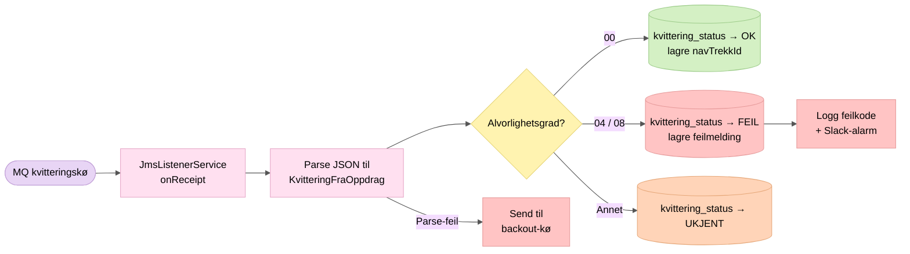

# 5. Kvittering fra Oppdrag Z

`JmsListenerService` lytter kontinuerlig på kvitteringskøen. Kvitteringer prosesseres asynkront uavhengig av den schedulerte jobben.

## Kvitteringsstatus

| Alvorlighetsgrad | Kvitteringsstatus | Betydning |
|---|---|---|
| 00 | `OK` | Trekket er akseptert av Oppdrag Z |
| 04 / 08 | `FEIL` | Trekket er avvist (feilmelding lagres) |
| Annet | `UKJENT` | Uventet alvorlighetsgrad |

## Feilhåndtering

- Kvitteringert som feiler under parsing, validering eller prosessering sendes til en **backout-kø** (BOQ) 
- `MessageFormatException` (tom/uleselig melding) sendes **ikke** til BOQ
- Ved `FEIL`-kvittering lagres feilkode og beskrivelse i `feilmelding`-tabellen
- Fødselsnummer i feilbeskrivelser maskeres i logger

## Nøkkelpunkter

- Lytteren kjører kontinuerlig (ikke bare under scheduler-kjøring)
- Meldinger `acknowledge()`-es etter vellykket prosessering
- `navTrekkId` fra kvitteringen lagres for å knytte trekket i OS tilbake til vår transaksjon
