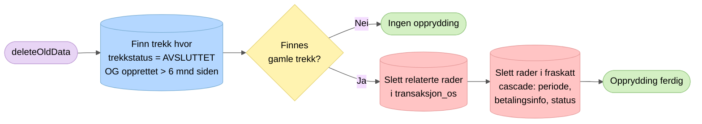

# 6. Opprydding

Kjøres ved slutten av hver schedulert jobb (`schedule()`). Sletter data for trekk som er avsluttet og eldre enn 6 måneder.

## Sletterekkefølge

Tabellene har fremmednøkler, så sletting skjer i riktig rekkefølge:

| Steg | Tabell | Relasjon |
|------|--------|----------|
| 1 | `transaksjon_os` (+ `periode_til_os`) | Knyttet via trekkid |
| 2 | `fraskatt` | Cascade sletter: `periode`, `betalingsinformasjon`, `fraskatt_status` |

## Nøkkelpunkter

- Når minst én avsluttet versjon er eldre enn 6 måneder, slettes alle versjoner og OS-transaksjoner med samme `trekkid`
- 6-måneders grensen gir tid til manuell feiloppfølging
- Kjøres alltid, uavhengig av feature toggles
