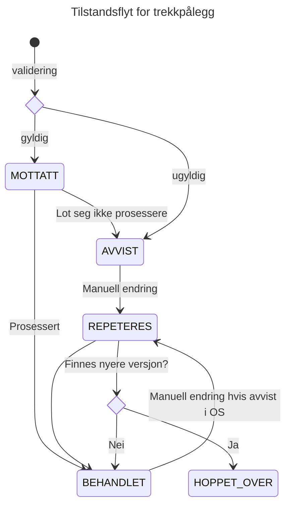

## Tilstandsflyt

Tilstandsflyten til et trekkpålegg.
* Validering: Trekkpålegget valideres mot skjema. Hvis gyldig går det til MOTTATT, hvis ugyldig går det til FEIL.
* MOTTATT: Trekkpålegget er mottatt og venter på å bli prosessert.
* BEHANDLET: Trekkpålegget er prosessert og ferdig.
* AVVIST: Trekkpålegget har feil og må endres manuelt før det kan prosesseres.
* REPETERES: Trekkpålegget er endret manuelt og venter på å bli prosessert på nytt.
* HOPPET_OVER: Trekkpålegget er ignorert fordi en nyere versjon finnes.

Vi regner med at flyten i de aller fleste tilfeller er validering -> MOTTATT -> BEHANDLET. REPETERES eksisterer for å kunne føre
et tidligere avvist trekk tilbake i normal flyt etter manuell korreksjon.
Når et trekkpålegg er BEHANDLET betyr det at det finnes ett eller to dokumenter i databasen klar for sending til Oppdrag Z. 

## Om behandlingen av trekkpålegg.
Trekkpålegg fra Skatteetaten blir omgjort til Innrapporteringstrekk som sendes til Oppdrag Z. 
Når et nytt trekkpålegg mottas ser vi først om det er et nytt eller et eksisterende trekk i Oppdrag Z. 
Dersom det finnes perioder med både prosenttrekk og beløpstrekk, når man ser samlet på trekkpålegget og relaterte 
innrapporteringstrekk blir to dokumenter med Innrapporteringstrekk laget.

Trekkpåleggets trekkid blir til kreditor_trekk_id i trekkpålegget hvor vi legger på en P eller M avhengig om det er prosent
eller månedstrekk, men siden kreditor_trekk_id er begrenset til 35 tegn, og trekkid ofte vil være en 36 tegns UUID v4 tar
vi vekk bindestrekene. Fordi feltet fra Skatteetaten er av ubegrenset lengde genererer vi for sikkerhetsskyld en BASE64 encodet
kryptografisk digest med suffix -P eller -M dersom en trekkid på mer enn 34 tegn som ikke er en UUID.

Sokos-utleggstrekk vil se etter perioder den har sendt til OS som ikke lenger finnes i trekkpålegget fra Skatteetaten. 
Disse periodene vil bli reperert i de nye dokumentene mend verdien satt til 0. Nye perioder i blir opprettet hvis nødvendig.
En periode som går fra å være uendelig til endelig blir betraktet som to oppdateringer, en som nuller den uendelige perioden
og en som oppretter den nye endelige.

En periode i Oppdrag som tilhører et månedstrekk (beløpstrekk) må starte på den 1. dagen i måneden og avsluttes på den siste.
For å forenkle har vi latt dette gjelder begge trekkalternativ (prosent og beløp). Dette vil medføre at de avrundede periodene
fra Skattetaten vil kunne være overlappende i tid. Dette løser vi ved å la påfølgende trekk overskrive periodene til eldre trekk.
Hvis et trekk har en periode som slutter den 6. Mars blir dette avrundet til den 31. Mars, men hvis en ny periode begynner
den 7. Mars, blir denne avrundet til å starte den 1. Mars. Den forrige perioden blir overstyrt av den nye og avsluttes derfor
istedet den siste dagen i Februar.

Når et trekk avsluttes sender vi ingen periodeoppdateringer til Oppdrag.

