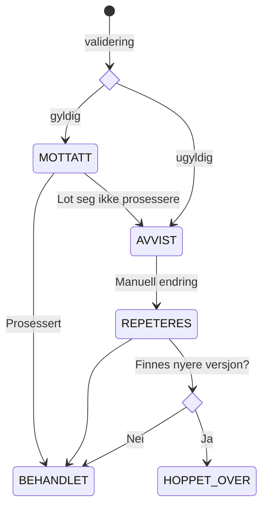

## Tilstandsflyt

Tilstandsflyten til et trekkpålegg.
* Validering: Trekkpålegget valideres mot skjema. Hvis gyldig går det til MOTTATT, hvis ugyldig går det til FEIL.
* MOTTATT: Trekkpålegget er mottatt og venter på å bli prosessert.
* BEHANDLET: Trekkpålegget er prosessert og ferdig.
* AVVIST: Trekkpålegget har feil og må endres manuelt før det kan prosesseres.
* REPETERES: Trekkpålegget er endret manuelt og venter på å bli prosessert på nytt.
* HOPPET_OVER: Trekkpålegget er ignorert fordi en nyere versjon finnes.

Vi regner med at flyten i de aller fleste tilfeller er validering -> MOTTATT -> BEHANDLET. REPETERES eksisterer for å kunne føre
et tidligere avvist trekk tilbake i normal flyt etter manuell korreksjon.
Når et trekkpålegg er BEHANDLET betyr det at det finnes ett eller to dokumenter i databasen klar for sending til Oppdrag Z. 

