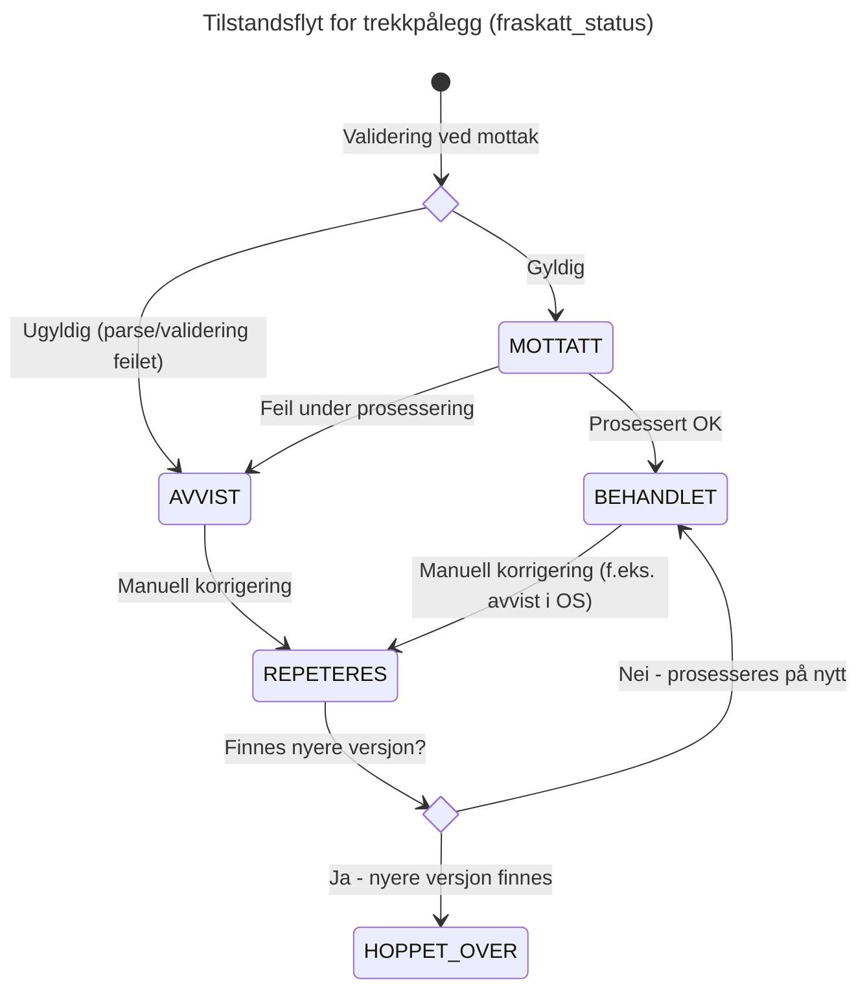
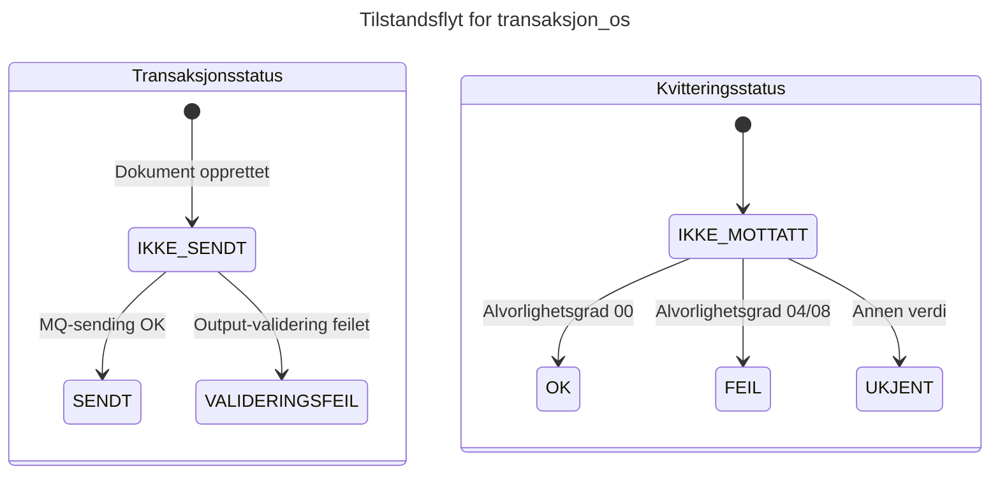
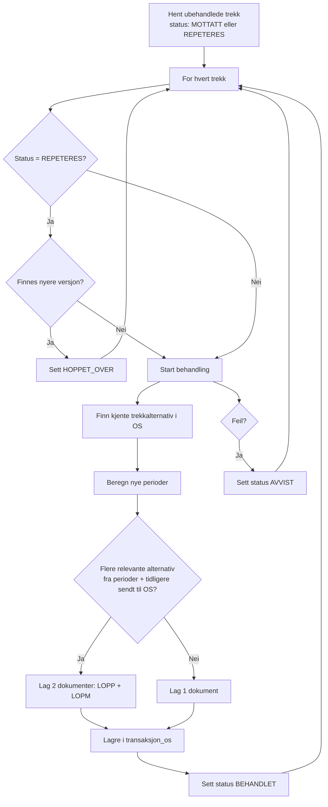
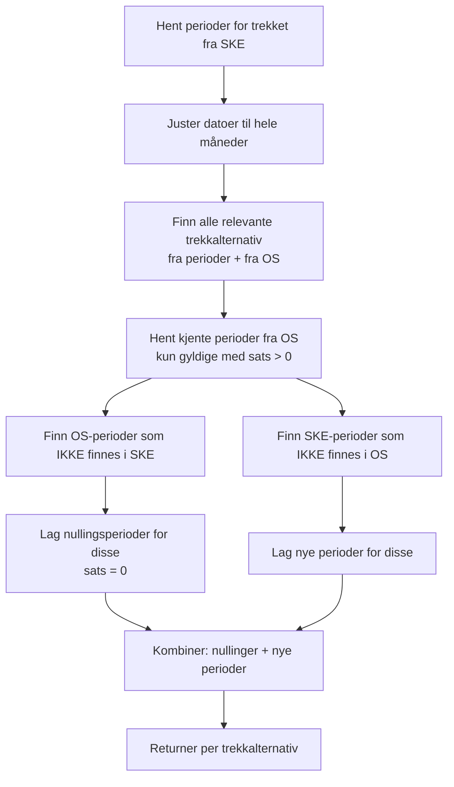
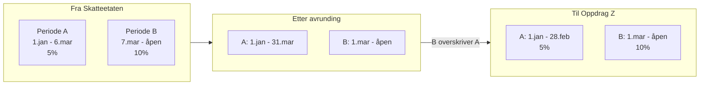
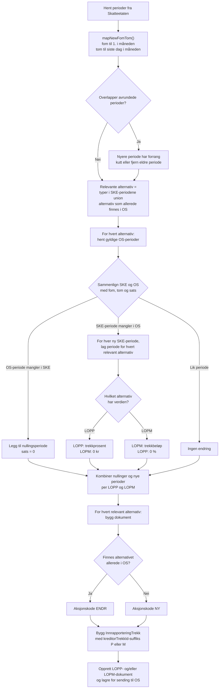
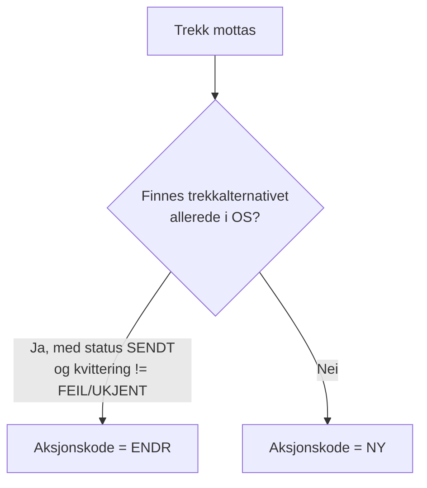
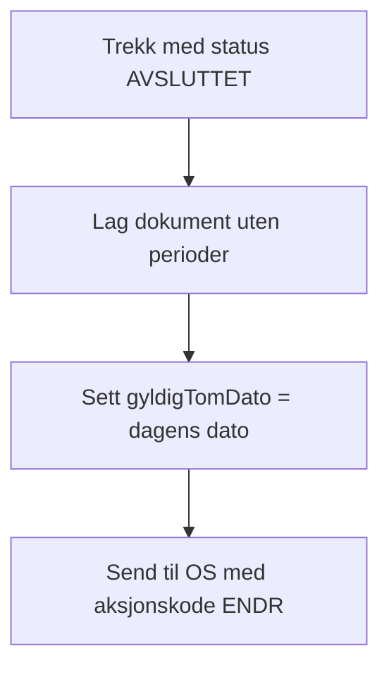
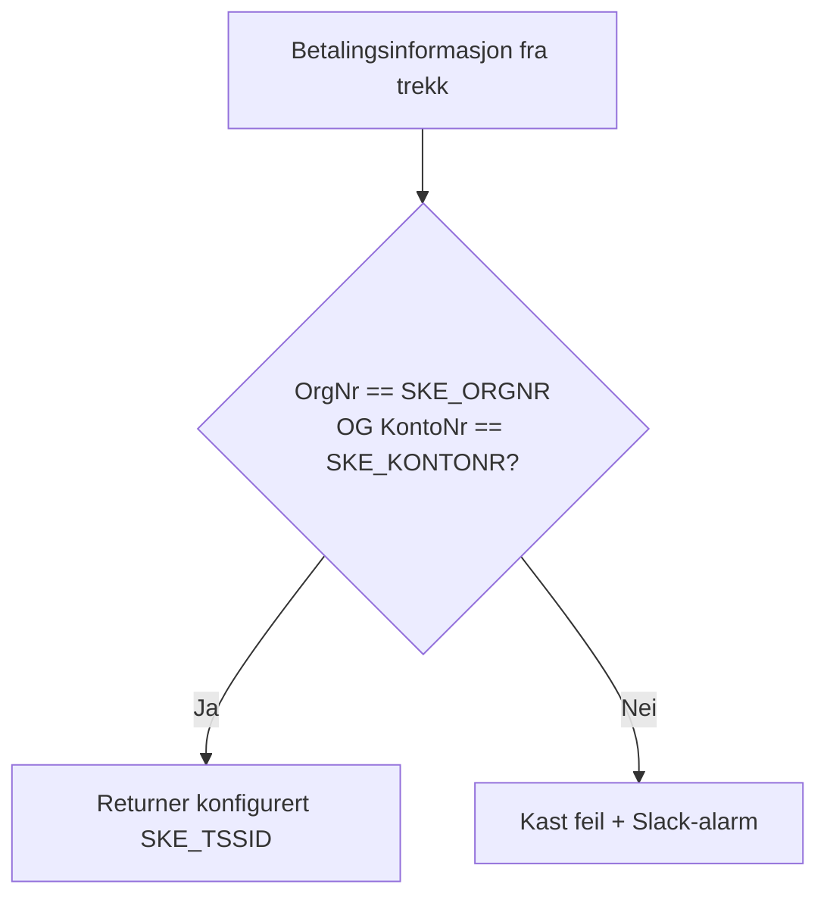
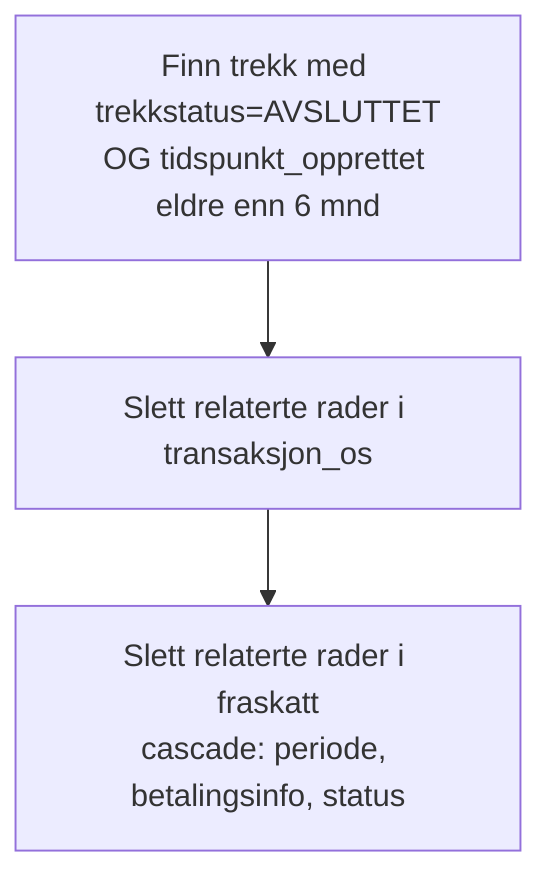

# Flytdiagram og forretningslogikk

## Tilstandsflyt for trekkpålegg

Et trekkpålegg fra Skatteetaten går gjennom følgende tilstander i `fraskatt_status`:

```mermaid
---
title: Tilstandsflyt for trekkpålegg (fraskatt_status)
---
stateDiagram-v2
    state if_state <<choice>>
    state finnes_nyere <<choice>>

    [*] --> if_state : Validering ved mottak
    if_state --> MOTTATT : Gyldig
    if_state --> AVVIST : Ugyldig (parse/validering feilet)
    MOTTATT --> BEHANDLET : Prosessert OK
    MOTTATT --> AVVIST : Feil under prosessering
    AVVIST --> REPETERES : Manuell korrigering
    BEHANDLET --> REPETERES : Manuell korrigering (f.eks. avvist i OS)
    REPETERES --> finnes_nyere : Finnes nyere versjon?
    finnes_nyere --> HOPPET_OVER : Ja - nyere versjon finnes
    finnes_nyere --> BEHANDLET : Nei - prosesseres på nytt
```

### Tilstandsbeskrivelser

| Tilstand | Betydning | Hva skjer videre |
|----------|-----------|------------------|
| **MOTTATT** | Trekkpålegg er lagret og venter på prosessering | Blir BEHANDLET eller AVVIST |
| **BEHANDLET** | Dokumenter til Oppdrag Z er laget | Normalt sluttpunkt |
| **AVVIST** | Feil i data eller prosessering | Kan settes til REPETERES manuelt |
| **REPETERES** | Manuelt korrigert, venter på ny prosessering | Blir BEHANDLET eller HOPPET_OVER |
| **HOPPET_OVER** | Ignorert fordi en nyere trekkversjon finnes | Sluttpunkt |

**Normal flyt** (99% av tilfellene): Validering → MOTTATT → BEHANDLET

---

## Tilstandsflyt for transaksjoner til Oppdrag Z

Når et trekk er BEHANDLET finnes det dokumenter i `transaksjon_os`:

```mermaid
---
title: Tilstandsflyt for transaksjon_os
---
stateDiagram-v2
    state "Transaksjonsstatus" as transaksjon_status {
        [*] --> IKKE_SENDT : Dokument opprettet
        IKKE_SENDT --> SENDT : MQ-sending OK
        IKKE_SENDT --> VALIDERINGSFEIL : Output-validering feilet
    }

    state "Kvitteringsstatus" as kvittering_status {
        [*] --> IKKE_MOTTATT
        IKKE_MOTTATT --> OK : Alvorlighetsgrad 00
        IKKE_MOTTATT --> FEIL : Alvorlighetsgrad 04/08
        IKKE_MOTTATT --> UKJENT : Annen verdi
    }
```

Transaksjonsstatus og kvitteringsstatus lagres uavhengig av hverandre. En
kvittering endrer derfor ikke transaksjonsstatusen `SENDT`.

### Transaksjonsstatus + kvitteringsstatus

| transaksjon_status | kvittering_status | Betydning |
|-------------------|-------------------|-----------|
| IKKE_SENDT | IKKE_MOTTATT | Venter på sending (neste kjøring) |
| SENDT | IKKE_MOTTATT | Sendt, venter på kvittering |
| SENDT | OK | Akseptert av Oppdrag Z |
| SENDT | FEIL | Avvist av Oppdrag Z (se feilmelding-tabell) |
| SENDT | UKJENT | Ukjent alvorlighetsgrad i kvittering |
| VALIDERINGSFEIL | IKKE_MOTTATT | Dokumentet passerte ikke output-validering |

---

## Behandling av trekkpålegg (hovedalgoritme)

```mermaid
flowchart TD
    START[Hent ubehandlede trekk<br/>status: MOTTATT eller REPETERES] --> LOOP[For hvert trekk]
    LOOP --> CHECK_REP{Status = REPETERES?}
    CHECK_REP -->|Ja| NEWER{Finnes nyere versjon?}
    NEWER -->|Ja| SKIP[Sett HOPPET_OVER]
    NEWER -->|Nei| PROCESS
    CHECK_REP -->|Nei| PROCESS[Start behandling]

    PROCESS --> GET_ALT[Finn kjente trekkalternativ i OS]
    GET_ALT --> CALC_PERIODS[Beregn nye perioder]
    CALC_PERIODS --> SPLIT{Flere relevante alternativ<br/>fra perioder + tidligere sendt til OS?}
    SPLIT -->|Ja| TWO_DOCS[Lag 2 dokumenter: LOPP + LOPM]
    SPLIT -->|Nei| ONE_DOC[Lag 1 dokument]
    TWO_DOCS --> SAVE
    ONE_DOC --> SAVE[Lagre i transaksjon_os]
    SAVE --> DONE[Sett status BEHANDLET]
    DONE --> LOOP

    SKIP --> LOOP

    PROCESS --> ERR{Feil?}
    ERR -->|Ja| AVVIST[Sett status AVVIST]
    AVVIST --> LOOP
```

---

## Periodeberegning (detaljert)

Den mest komplekse delen av forretningslogikken. Beregner hvilke perioder som skal sendes til OS.

```mermaid
flowchart TD
    A[Hent perioder for trekket fra SKE] --> B[Juster datoer til hele måneder]
    B --> C[Finn alle relevante trekkalternativ<br/>fra perioder + fra OS]
    C --> D[Hent kjente perioder fra OS<br/>kun gyldige med sats > 0]

    D --> E[Finn OS-perioder som IKKE finnes i SKE]
    E --> F[Lag nullingsperioder for disse<br/>sats = 0]

    D --> G[Finn SKE-perioder som IKKE finnes i OS]
    G --> H[Lag nye perioder for disse]

    F --> I[Kombiner: nullinger + nye perioder]
    H --> I
    I --> J[Returner per trekkalternativ]
```

### Datoavrunding

Perioder i Oppdrag Z må starte på 1. i måneden og slutte på siste dag i måneden:

| SKE-dato | OS-dato | Regel |
|----------|---------|-------|
| startdato: 2025-03-15 | periodeFomDato: 2025-03-01 | Rund ned til 1. i mnd |
| sluttdato: 2025-06-20 | periodeTomDato: 2025-06-30 | Rund opp til siste dag i mnd |
| sluttdato: null (åpen) | periodeTomDato: null | Forblir åpen |

### Håndtering av overlappende perioder

Når avrunding skaper overlapp (f.eks. periode A slutter 6. mars → avrundet til 31. mars, periode B starter 7. mars → avrundet til 1. mars), løses dette ved at **nyere perioder overskriver eldre**:

```mermaid
flowchart LR
    subgraph SKE["Fra Skatteetaten"]
        PA["Periode A<br/>1.jan - 6.mar<br/>5%"]
        PB["Periode B<br/>7.mar - åpen<br/>10%"]
    end

    subgraph Avrundet["Etter avrunding"]
        PA2["A: 1.jan - 31.mar"]
        PB2["B: 1.mar - åpen"]
    end

    subgraph OS["Til Oppdrag Z"]
        PA3["A: 1.jan - 28.feb<br/>5%"]
        PB3["B: 1.mar - åpen<br/>10%"]
    end

    SKE --> Avrundet
    Avrundet -->|"B overskriver A"| OS
```

---

## Omgjøring av perioder og dokumenter per trekkalternativ

Skatteetaten sender et komplett øyeblikksbilde, mens Oppdrag Z mottar endringer. Før dokumentene bygges, justeres derfor periodene til hele måneder og sammenlignes med det som allerede er sendt til OS. Diagrammet viser både diff-beregningen og hvorfor ett trekkpålegg kan gi dokumenter for både LOPP og LOPM.

```mermaid
flowchart TD
    SKE[Hent perioder fra Skatteetaten] --> ROUND["mapNewFomTom()<br/>fom til 1. i måneden<br/>tom til siste dag i måneden"]
    ROUND --> OVERLAP{Overlapper avrundede perioder?}
    OVERLAP -->|Ja| TRIM[Nyere periode har forrang<br/>kutt eller fjern eldre periode]
    OVERLAP -->|Nei| ALT
    TRIM --> ALT[Relevante alternativ =<br/>typer i SKE-periodene union<br/>alternativ som allerede finnes i OS]

    ALT --> OS[For hvert alternativ:<br/>hent gyldige OS-perioder]
    OS --> DIFF{Sammenlign SKE og OS<br/>med fom, tom og sats}
    DIFF -->|OS-periode mangler i SKE| ZERO[Legg til nullingsperiode<br/>sats = 0]
    DIFF -->|SKE-periode mangler i OS| NEW[For hver ny SKE-periode,<br/>lag periode for hvert relevant alternativ]
    DIFF -->|Lik periode| SKIP[Ingen endring]

    NEW --> VALUE{Hvilket alternativ<br/>har verdien?}
    VALUE -->|LOPP| PERCENT[LOPP: trekkprosent<br/>LOPM: 0 kr]
    VALUE -->|LOPM| AMOUNT[LOPM: trekkbeløp<br/>LOPP: 0 %]
    ZERO --> COMBINE[Kombiner nullinger og nye perioder<br/>per LOPP og LOPM]
    PERCENT --> COMBINE
    AMOUNT --> COMBINE
    SKIP --> COMBINE

    COMBINE --> DOCS[For hvert relevant alternativ:<br/>bygg dokument]
    DOCS --> KNOWN{Finnes alternativet<br/>allerede i OS?}
    KNOWN -->|Ja| ENDR[Aksjonskode ENDR]
    KNOWN -->|Nei| NY[Aksjonskode NY]
    ENDR --> BUILD[Bygg InnrapporteringTrekk<br/>med kreditorTrekkId-suffiks P eller M]
    NY --> BUILD
    BUILD --> OUT[Opprett LOPP- og/eller LOPM-dokument<br/>og lagre for sending til OS]
```

### Hvorfor to dokumenter?

Oppdrag Z krever at ett trekk har én trekktype: prosent (`LOPP`) eller beløp (`LOPM`). Skatteetaten knytter derimot typen til hver enkelt periode. Når et trekkpålegg har perioder av begge typer, må samme tidslinje derfor representeres i to dokumenter:

| Dokument | Har verdi for | Settes til null for |
|----------|---------------|---------------------|
| `LOPP` | Perioder med trekkprosent | Perioder med trekkbeløp |
| `LOPM` | Perioder med trekkbeløp | Perioder med trekkprosent |

Nullperiodene sørger for at begge dokumentene dekker samme perioder, samtidig som bare korrekt trekkype er gyldig i hver periode. Et alternativ som allerede finnes i OS beholdes også i beregningen, selv om den nyeste SKE-versjonen ikke inneholder typen lenger; slik kan tidligere perioder nulles i stedet for å bli stående aktive.

Se også [trekksplitting](../trekksplitting/README.md) for et konkret eksempel og [periodeberegning](../periodeberegning/README.md) for den detaljerte diff-algoritmen.

---

## Aksjonskode-bestemmelse

```mermaid
flowchart TD
    A[Trekk mottas] --> B{Finnes trekkalternativet<br/>allerede i OS?}
    B -->|Ja, med status SENDT<br/>og kvittering != FEIL/UKJENT| C[Aksjonskode = ENDR]
    B -->|Nei| D[Aksjonskode = NY]
```

---

## Trekk-avslutning

Når et trekk har `trekkstatus = AVSLUTTET`:

```mermaid
flowchart TD
    A[Trekk med status AVSLUTTET] --> B[Lag dokument uten perioder]
    B --> C[Sett gyldigTomDato = dagens dato]
    C --> D[Send til OS med aksjonskode ENDR]
```

**Viktig**: Ved avslutning sendes **ingen periodeoppdateringer** – kun `gyldigTomDato` settes.

---

## TssIdResolver – Kreditor-identifikasjon

```mermaid
flowchart TD
    A[Betalingsinformasjon fra trekk] --> B{OrgNr == SKE_ORGNR<br/>OG KontoNr == SKE_KONTONR?}
    B -->|Ja| C[Returner konfigurert SKE_TSSID]
    B -->|Nei| D[Kast feil + Slack-alarm]
```

Foreløpig støtter applikasjonen kun Skatteetaten som kreditor. Andre kreditorer vil gi feil.

---

## Opprydding av gamle data

Kjøres ved slutten av hver schedulert jobb:

```mermaid
flowchart TD
    A[Finn trekk med trekkstatus=AVSLUTTET<br/>OG tidspunkt_opprettet eldre enn 6 mnd] --> B[Slett relaterte rader i transaksjon_os]
    B --> C[Slett relaterte rader i fraskatt<br/>cascade: periode, betalingsinfo, status]
```
