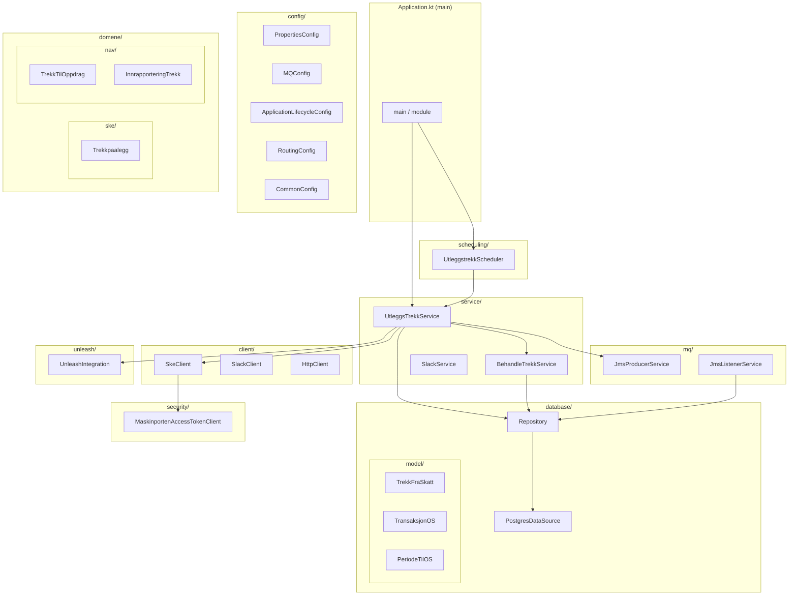
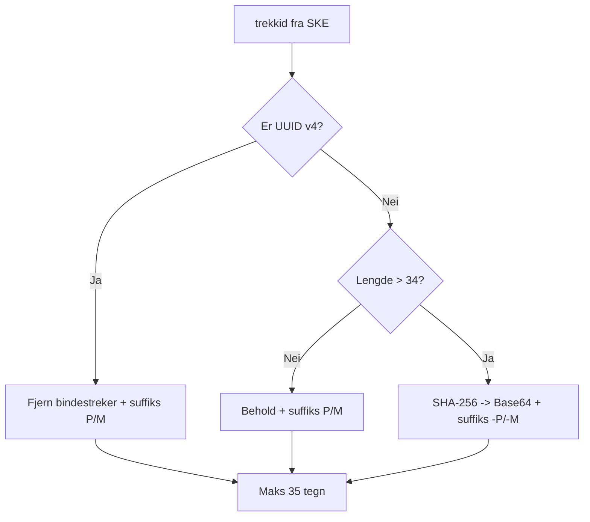
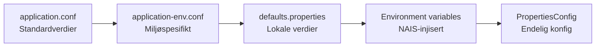

# Kodestruktur

## Pakkeoversikt



---

## Viktige klasser og ansvar

### Oppstart og konfigurasjon

| Klasse | Fil | Ansvar |
|--------|-----|--------|
| `main()` | `Application.kt` | Starter Ktor-server på port 8080 |
| `Application.module()` | `Application.kt` | Konfigurerer alt: props, lifecycle, routing, scheduler |
| `PropertiesConfig` | `config/PropertiesConfig.kt` | Singleton som holder all konfigurasjon (HOCON-basert) |
| `UtleggstrekkScheduler` | `scheduling/UtleggstrekkScheduler.kt` | Planlegger timebaserte og daglige jobber |

### Forretningslogikk (kjernen)

| Klasse | Fil | Ansvar |
|--------|-----|--------|
| `UtleggsTrekkService` | `service/UtleggsTrekkService.kt` | **Orkestrator** – styrer hele flyten: hent, behandle, send |
| `BehandleTrekkService` | `service/BehandleTrekkService.kt` | **Transformator** – konverterer trekkpålegg til OS-dokumenter |

### Kommunikasjon

| Klasse | Fil | Ansvar |
|--------|-----|--------|
| `SkeClient` | `client/SkeClient.kt` | HTTP-klient mot Skatteetatens REST API |
| `JmsProducerService` | `mq/JmsProducerService.kt` | Sender meldinger til Oppdrag Z via MQ |
| `JmsListenerService` | `mq/JmsListenerService.kt` | Lytter på kvitteringer fra Oppdrag Z |
| `MaskinportenAccessTokenClient` | `security/maskinporten/...` | Henter og cacher OAuth2-tokens |
| `SlackService` | `service/SlackService.kt` | Samler og sender feilmeldinger til Slack |

### Database

| Klasse | Fil | Ansvar |
|--------|-----|--------|
| `Repository` | `database/Repository.kt` | All databaseaksess (queries via kotliquery) |
| `PostgresDataSource` | `database/PostgresDataSource.kt` | HikariCP connection pool + Flyway-migrering |

### Domenemodeller

| Klasse | Fil | Representerer |
|--------|-----|---------------|
| `Trekkpaalegg` | `domene/ske/Trekkpaalegg.kt` | Inndata fra Skatteetaten |
| `TrekkTilOppdrag` | `domene/nav/TrekktilOppdrag.kt` | Utdata til Oppdrag Z |
| `InnrapporteringTrekk` | `domene/nav/TrekktilOppdrag.kt` | Selve trekk-dokumentet til OS |
| `KvitteringFraOppdrag` | `domene/nav/TrekktilOppdrag.kt` | Kvittering (samme format som TrekkTilOppdrag) |

### Databasemodeller

| Klasse | Fil | Tabell |
|--------|-----|--------|
| `TrekkFraSkatt` | `database/model/TrekkFraSkatt.kt` | `fraskatt` |
| `PeriodeFraSkatt` | `database/model/TrekkFraSkatt.kt` | `periode` |
| `BetalingsinformasjonFraSkatt` | `database/model/TrekkFraSkatt.kt` | `betalingsinformasjonfraskatt` |
| `TransaksjonOS` | `database/model/TransaksjonOS.kt` | `transaksjon_os` |
| `PeriodeTilOS` | `database/model/PeriodeTilOS.kt` | `periode_til_os` |

---

## Detaljert gjennomgang av kjerneklasser

### UtleggsTrekkService – Orkestratoren

Dette er den sentrale klassen som styrer hele flyten. Den kalles av scheduleren.

```kotlin
schedule() {
    // Steg 1: Hent fra Skatteetaten (styrt av Unleash)
    if (hentFraSKE.enabled) lagreAlleNyeUtleggstrekk()

    // Steg 2: Behandle/prosesser (styrt av Unleash)
    if (prosesserUtleggstrekk.enabled) BehandleTrekkService().behandleTrekk()

    // Steg 3: Send til OS (styrt av Unleash)
    if (sendTilOS.enabled) sendTransaksjoner()

    // Steg 4: Rydd opp
    repository.deleteOldData()

    // Steg 5: Oppdater metrikker + send eventuelle Slack-feil
    calculateMetrics()
    slackService.sendCachedErrors()
}
```

**Viktig**: Henting fra Skatteetaten gjøres i en løkke – så lenge API-et returnerer `MAX_ANTALL` (2500) trekk, hentes det flere. Dette sikrer at alle nye trekk blir hentet selv om det er mange.

### BehandleTrekkService – Transformatoren

Konverterer trekkpålegg fra Skatteetatens format til Oppdrag Z-format. Håndterer:

1. **Trekksplitting**: Et trekk med både prosent- og beløpperioder blir to dokumenter
2. **Diff-beregning**: Sammenlikner med tidligere sendte perioder for å beregne hva som er nytt/endret
3. **Periodenullering**: Perioder som ikke lenger finnes i SKE nulles (sats=0) i OS
4. **Datoavrunding**: Perioder rundes til hele måneder (1. i mnd → siste dag i mnd)
5. **Aksjonskode**: NY for nye trekk, ENDR for eksisterende

### JmsListenerService – Kvitteringsmottaker

Lytter asynkront på MQ-køen for kvitteringer fra Oppdrag Z:
- **Alvorlighetsgrad 00**: Trekket er akseptert – lagrer `nav_trekk_id`
- **Alvorlighetsgrad 04/08**: Trekket er avvist – lagrer feilmelding og varsler Slack
- **Parsefeil**: Meldingen sendes til backout-kø (BOQ) for manuell håndtering

---

## ID-konvertering (SyntetiskId)

Skatteetatens `trekkid` konverteres til `kreditor_trekk_id` for Oppdrag Z:



Eksempler:
- UUID `a1b2c3d4-e5f6-7890-abcd-ef1234567890` → `a1b2c3d4e5f67890abcdef1234567890P`
- Kort ID `TREKK123` → `TREKK123P`
- Lang ID (>34 tegn) → `<base64-hash>-P`

---

## Konfigurasjonsmodell (HOCON)

Konfigurasjon lastes lagvis med overstyring:



Miljø bestemmes av `NAIS_CLUSTER_NAME` (f.eks. `dev-gcp` → `dev`).

---

## Metrikker

Eksponeres på `/internal/metrics` i Prometheus-format:

| Metrikk | Type | Beskrivelse |
|---------|------|-------------|
| `sokos_utleggstrekk_utleggstrekk_fra_skatt` | Counter | Trekkversjoner mottatt fra SKE |
| `sokos_utleggstrekk_trekk_sendt_til_os` | Counter | Trekk sendt til Oppdrag Z |
| `sokos_utleggstrekk_trekk_kvittert_for_av_os` | Counter | Trekk kvittert OK |
| `sokos_utleggstrekk_trekk_avvist_av_os` | Counter | Trekk avvist av OS |
| `sokos_utleggstrekk_utleggstrekk_fra_skatt_aktive` | Gauge | Antall aktive trekk |
| `sokos_utleggstrekk_utleggstrekk_fra_skatt_avsluttet` | Gauge | Antall avsluttede trekk |
| `sokos_utleggstrekk_antall_aktive_trekk_kvittert_av_OS` | Gauge | Aktive trekk kvittert (per alternativ) |
| `sokos_utleggstrekk_tid_brukt_paa_lagring_av_utleggstrekk` | Gauge | ms/trekk for lagring |
| `sokos_utleggstrekk_tid_brukt_paa_metrikker` | Gauge | Sekunder brukt på metrikk-beregning |

---

## Testing

### Teststrategi

- **Unit-tester**: Forretningslogikk med MockK
- **Integrasjonstester**: Database med Testcontainers (PostgreSQL)
- **MQ-tester**: Embedded Apache Artemis broker
- **HTTP-tester**: Ktor test-host med mock HTTP-klient

### Testmiljø-deteksjon

`PropertiesConfig.isTest` settes automatisk når `systemProperty("isTest", "true")` er satt (skjer i Gradle test-task). Dette deaktiverer:
- Metrikk-oppdatering under tester
- Reelle Unleash-kall (bruker FakeUnleash)
