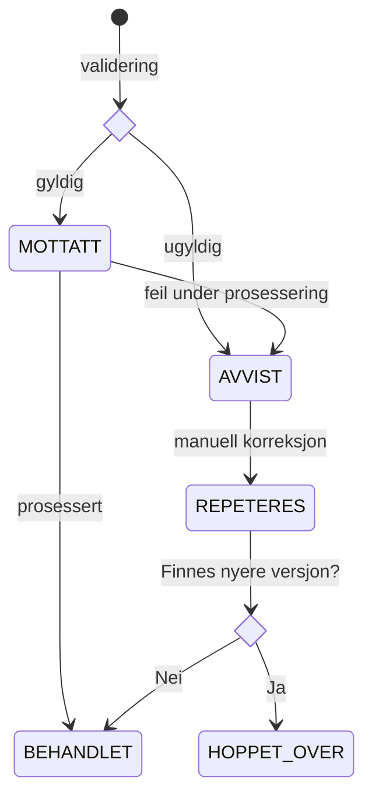

# Overordnet flyt – sokos-utleggstrekk

## Forretningsflyt

sokos-utleggstrekk kjører en **time for time** (på et konfigurerbart minutt) og utfører følgende steg i sekvens:

```
┌──────────────────────────────────────────────────────────────────────┐
│                    Schedulert jobb (hver time)                        │
│                                                                        │
│  1. Hent nye trekkpålegg fra Skatteetaten                            │
│       │                                                                │
│       ▼                                                                │
│  2. Valider og lagre trekkpålegg i databasen                         │
│       │                                                                │
│       ▼                                                                │
│  3. Transformer trekkpålegg til Oppdrag Z-format                     │
│       │                                                                │
│       ▼                                                                │
│  4. Send innrapporteringstrekk til Oppdrag Z via MQ                  │
│       │                                                                │
│       ▼                                                                │
│  5. Motta kvitteringer fra Oppdrag Z (asynkront)                     │
│       │                                                                │
│       ▼                                                                │
│  6. Rapporter manglende kvitteringer til Slack                       │
└──────────────────────────────────────────────────────────────────────┘
```

## Steg 1 – Hent trekkpålegg fra Skatteetaten

Applikasjonen husker siste mottatte **sekvensnummer** og spør Skatteetaten om alle trekkpålegg som er nyere enn dette. Skatteetaten returnerer kun gjeldende versjon av hvert trekk.

## Steg 2 – Validering og lagring

Hvert trekkpålegg valideres og lagres i databasen med status `MOTTATT`. Ugyldige trekk markeres `AVVIST` og rapporteres til Slack.

## Steg 3 – Transformasjon

Trekkpålegg i databasen med status `MOTTATT` prosesseres:
- **Nytt trekk** → aksjonskode `NY`
- **Endret trekk** → aksjonskode `ENDR` (kun endringer sendes)
- **Avsluttet trekk** → aksjonskode `OPPH`

Trekk som inneholder både prosentsats og beløpssats splittes i **to separate dokumenter** (ett for `P` og ett for `M`).

## Steg 4 – Sending via MQ

Ferdigbehandlede dokumenter sendes til Oppdrag Z over **IBM MQ** og markeres `SENDT` i databasen.

## Steg 5 – Kvitteringer (asynkront)

Oppdrag Z sender kvitteringer tilbake over en dedikert MQ-kø. Applikasjonen lytter kontinuerlig og lagrer:
- `nav_trekk_id` ved suksess
- Feilkode og beskrivelse ved feil

## Steg 6 – Varsling

Dokumenter uten kvittering etter forventet tid rapporteres til Slack. Metrics eksponeres til Prometheus.

## Tilstandsflyt for et trekkpålegg



| Status | Beskrivelse |
|--------|-------------|
| `MOTTATT` | Lagret og venter på behandling |
| `BEHANDLET` | Prosessert, dokument(er) klare for sending |
| `AVVIST` | Validerings- eller prosesseringsfeil |
| `REPETERES` | Manuelt korrigert, klar for ny prosessering |
| `HOPPET_OVER` | Overskrevet av nyere trekkversjon |
