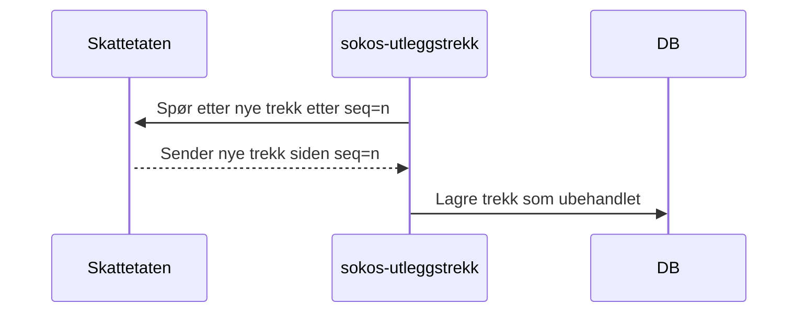
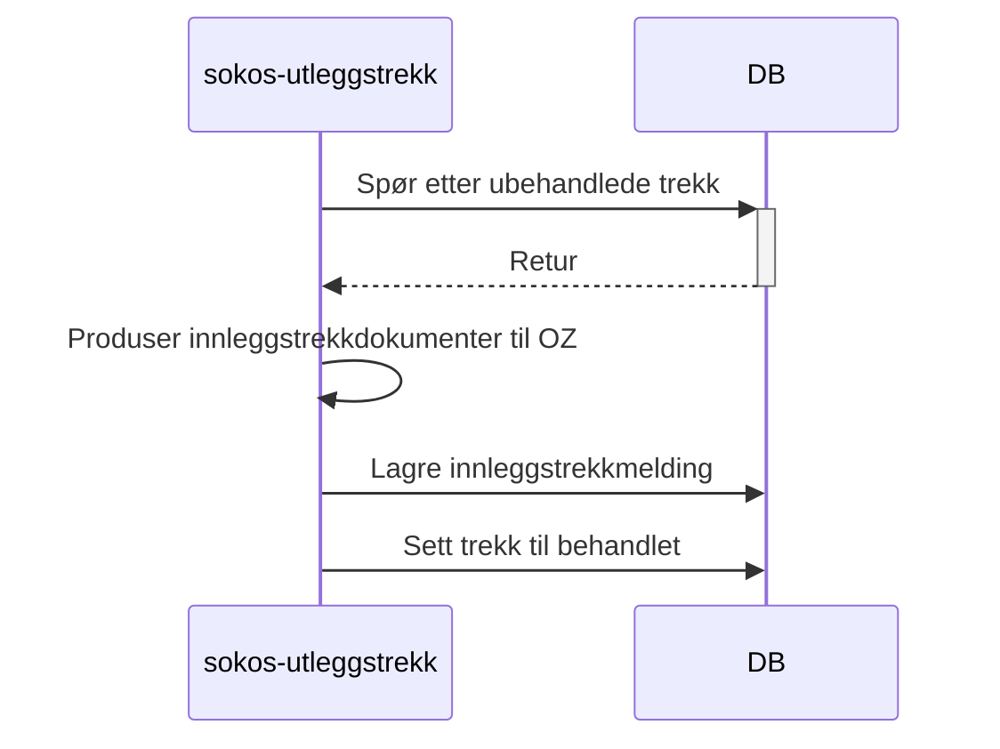
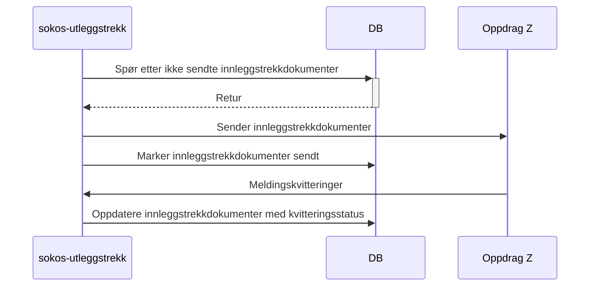

## Henting av trekk fra Skattetaten

```mermaid
sequenceDiagram
    participant Skattetaten
    participant sokosutleggstrekk as sokos-utleggstrekk
    participant DB
    sokosutleggstrekk->>+Skattetaten: Spør etter nye trekk etter seq=n
    Skattetaten-->>sokosutleggstrekk: Sender nye trekk siden seq=n
    sokosutleggstrekk->>DB: Lagre trekk som ubehandlet
``` 

## Behandling av trekk for å lage meldinger til Oppdrag Z 

```mermaid
sequenceDiagram
    participant sokosutleggstrekk as sokos-utleggstrekk
    participant DB
    
    sokosutleggstrekk->>+DB: Spør etter ubehandlede trekk
    DB-->>-sokosutleggstrekk: Retur

    sokosutleggstrekk->>sokosutleggstrekk: Produser innleggstrekkdokumenter til OZ
    sokosutleggstrekk->>DB: Lagre innleggstrekkmelding
    sokosutleggstrekk->>DB: Sett trekk til behandlet
``` 

## Sending av meldinginger til Oppdrag Z

```mermaid
sequenceDiagram
    participant sokosutleggstrekk as sokos-utleggstrekk
    participant DB
    participant Oppdrag Z
    
    sokosutleggstrekk->>+DB: Spør etter ikke sendte innleggstrekkdokumenter
    DB-->>-sokosutleggstrekk: Retur

    sokosutleggstrekk->>Oppdrag Z: Sender innleggstrekkdokumenter
    sokosutleggstrekk->>DB: Marker innleggstrekkdokumenter sendt
        
    Oppdrag Z->>sokosutleggstrekk: Meldingskvitteringer
    sokosutleggstrekk->>DB: Oppdatere innleggstrekkdokumenter med kvitteringsstatus
``` 
