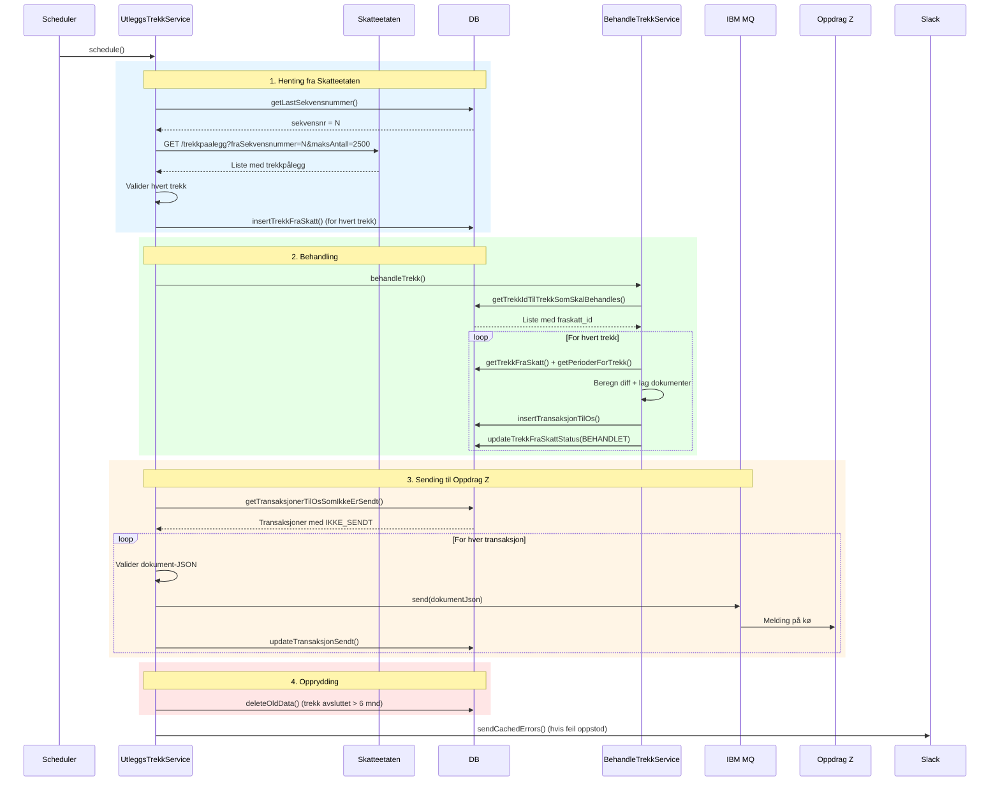
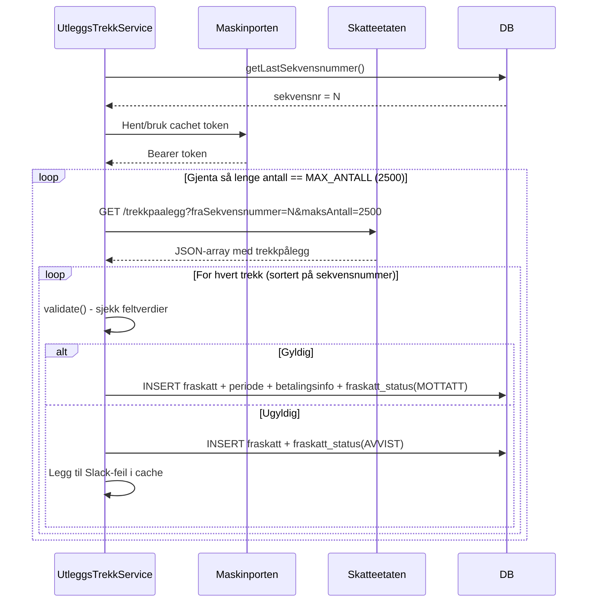
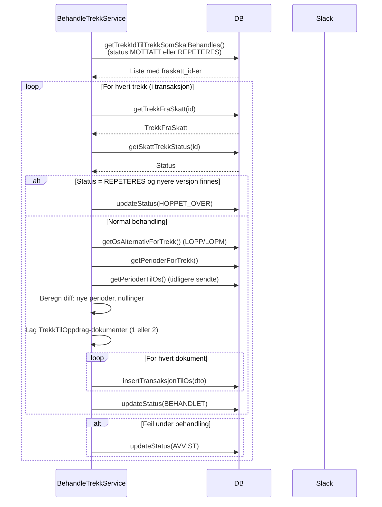
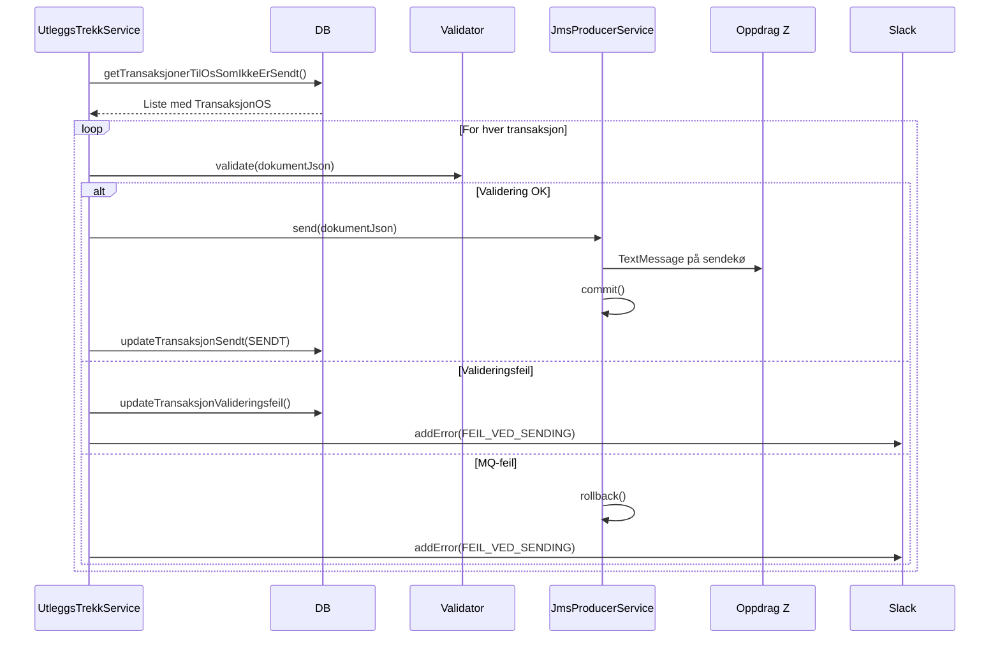
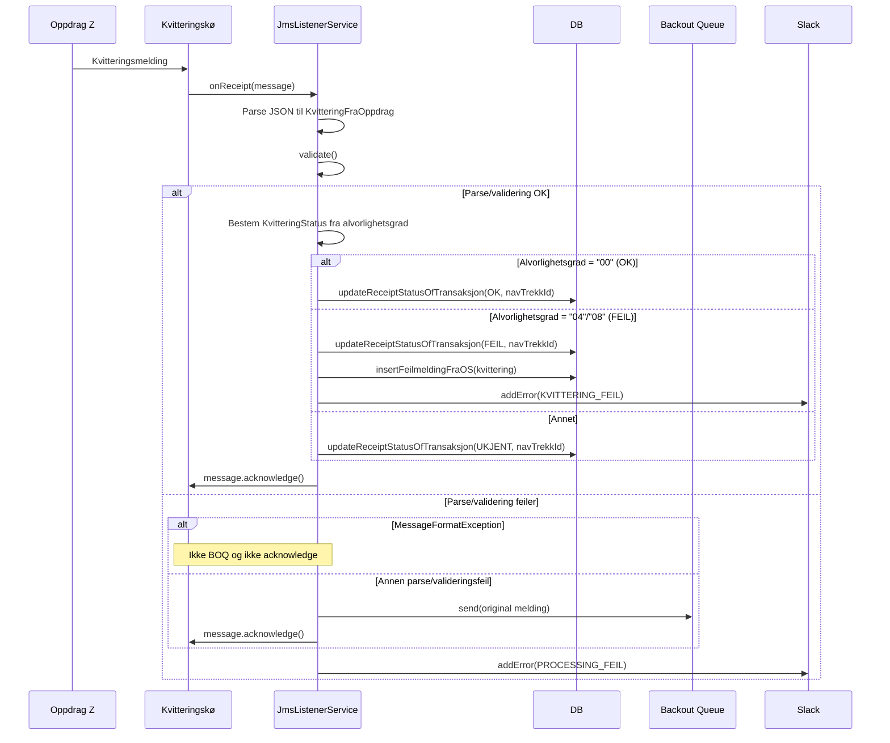
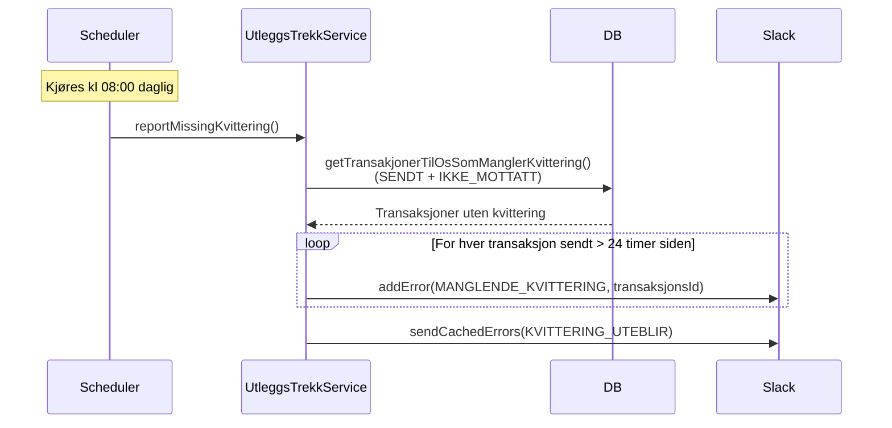
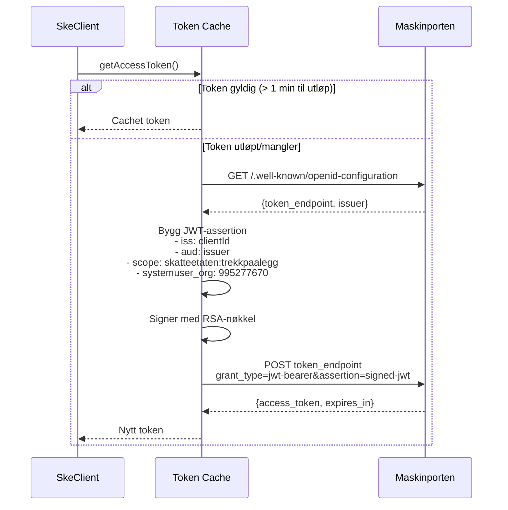

# Sekvensdiagrammer

## Komplett jobb-sekvens (oversikt)

---

## Henting av trekk fra Skatteetaten

---

## Behandling av trekk for å lage meldinger til Oppdrag Z

---

## Sending av meldinger til Oppdrag Z

---

## Mottak av kvitteringer fra Oppdrag Z

---

## Daglig rapport: Manglende kvitteringer

---

## Maskinporten token-flyt

