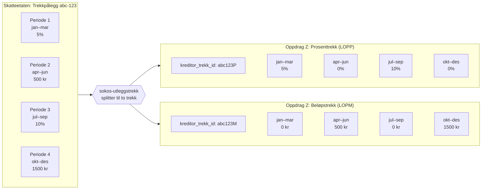
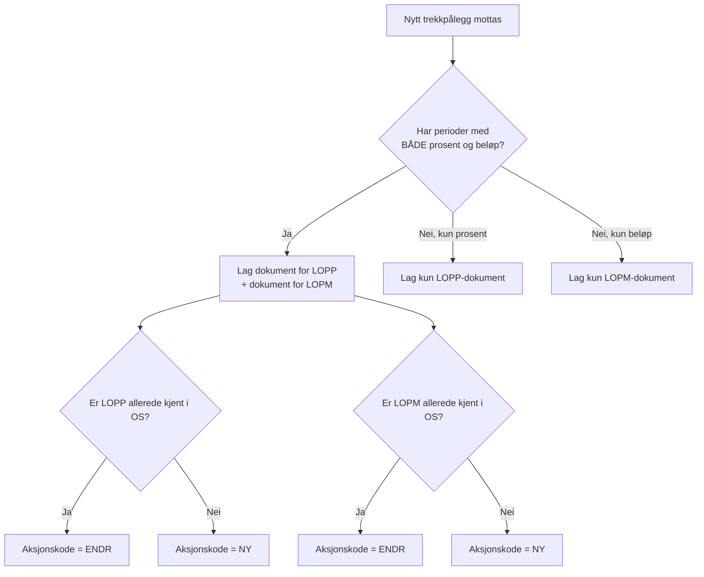

# Trekksplitting

## Problemet

Skatteetaten og Oppdrag Z modellerer trekk forskjellig:

- **Skatteetaten**: Ett trekk har flere perioder. Hver periode kan uavhengig ha prosentsats eller beløpssats.
- **Oppdrag Z**: Ett trekk er enten et prosenttrekk (LOPP) eller et beløpstrekk (LOPM). Alle perioder i trekket må være av samme type.

Altså: Skatteetaten legger typen på **perioden**, mens Oppdrag Z legger typen på **trekket**.

---

## Løsningen: Splitte ett trekk til to

Når et trekkpålegg fra Skatteetaten inneholder perioder med **både** prosent og beløp, kan det ikke representeres som ett enkelt trekk i Oppdrag Z. Derfor splitter sokos-utleggstrekk det til **to trekk** som begge representerer det samme underliggende trekkpålegget:

1. **Prosenttrekk (LOPP)** – inneholder alle perioder, men bare prosentperiodene har verdi. Beløpperiodene settes til 0%.
2. **Beløpstrekk (LOPM)** – inneholder alle perioder, men bare beløpperiodene har verdi. Prosentperiodene settes til 0 kr.

Begge trekk har **identiske perioder i tid** – det er bare satsen som varierer.

---

## Visuelt eksempel

Tenk deg at Skatteetaten sender følgende trekkpålegg med 4 perioder:

```
Trekkpålegg fra Skatteetaten (trekkid: abc-123)
├── Periode 1: jan–mar   → 5% (prosent)
├── Periode 2: apr–jun   → 500 kr (beløp)
├── Periode 3: jul–sep   → 10% (prosent)
└── Periode 4: okt–des   → 1500 kr (beløp)
```

sokos-utleggstrekk lager **to trekk** til Oppdrag Z – begge tilhører det samme trekkpålegget:



### Samme trekk, to representasjoner

| | Periode 1 (jan–mar) | Periode 2 (apr–jun) | Periode 3 (jul–sep) | Periode 4 (okt–des) |
|---|---|---|---|---|
| **SKE-trekk** | 5% | 500 kr | 10% | 1500 kr |
| **OS prosenttrekk (LOPP)** | **5%** | 0% | **10%** | 0% |
| **OS beløpstrekk (LOPM)** | 0 kr | **500 kr** | 0 kr | **1500 kr** |

Merk: I tabellen over er det **samme trekkpålegg** på alle tre radene. Verdiene i fet skrift er de "ekte" verdiene – resten er nuller som kreves fordi Oppdrag Z trenger perioder i begge trekk.

---

## Når splittes det IKKE?

Dersom alle perioder i et trekkpålegg er av **samme type** (kun prosent eller kun beløp), og det motsatte alternativet aldri tidligere er sendt til OS, lages det bare **ett** trekk til Oppdrag Z. Et tidligere kjent alternativ tas fortsatt med slik at gamle perioder kan nulles.

```
Trekkpålegg med kun prosent:
├── Periode 1: jan–mar → 5%
└── Periode 2: apr–des → 10%

→ Kun ett trekk i Oppdrag Z: LOPP med kreditor_trekk_id: abc123P
```

---

## Identifisering: kreditor_trekk_id

For å skille de to trekkene i Oppdrag Z brukes et suffiks på trekkid-en:

| Trekkalternativ | Suffiks | Eksempel (trekkid = UUID) |
|-----------------|---------|---------------------------|
| Prosent (LOPP) | `P` | `a1b2c3d4e5f67890abcdef1234567890P` |
| Beløp (LOPM) | `M` | `a1b2c3d4e5f67890abcdef1234567890M` |

Se [kodestruktur – ID-konvertering](../kodestruktur/README.md#id-konvertering-syntetiskid) for detaljer om hvordan trekkid konverteres.

---

## Konsekvens for diff-beregning

Fordi begge OS-trekk (LOPP og LOPM) representerer det **samme** trekkpålegget, må sokos-utleggstrekk:

1. Holde styr på hvilke trekkalternativ (LOPP/LOPM) som allerede er kjent i OS for dette trekkpålegget
2. Sende aksjonskode `NY` første gang et alternativ opprettes, deretter `ENDR`
3. Nulle perioder i det ene alternativet når de kun har verdi i det andre



---

## Eksempel med endring over tid

### Versjon 1: Nytt trekk med kun prosent

```
Trekkpålegg v1: trekkid=X, perioder: [jan–åpen, 5%]
→ OS: NY LOPP (kreditor_trekk_id: XP), periode jan–åpen, sats=5%
```

### Versjon 2: Endring – ny periode legges til med beløp

```
Trekkpålegg v2: trekkid=X, perioder: [jan–mar, 5%], [apr–åpen, 800 kr]
→ OS: ENDR LOPP (XP), perioder: [jan–mar, 5%], [apr–åpen, 0%]
→ OS: NY LOPM (XM), perioder: [jan–mar, 0 kr], [apr–åpen, 800 kr]
```

Nå finnes det plutselig **to** trekk i OS for trekkpålegg X – fordi versjon 2 introduserte en beløpsperiode.
